## A-Bot  
[Перейти на русскую версию](README.md) 

**The project has no other official sites with repositories and contacts, except for GitHub and Telegram!**  
**A-Bot does not work on US accounts and IP!**  

A-Bot is a free spot bot for algorithmic multicurrency trading on Binance, supporting manual and fully automated trading.    

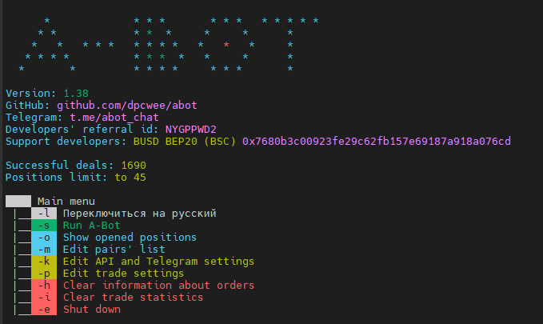  
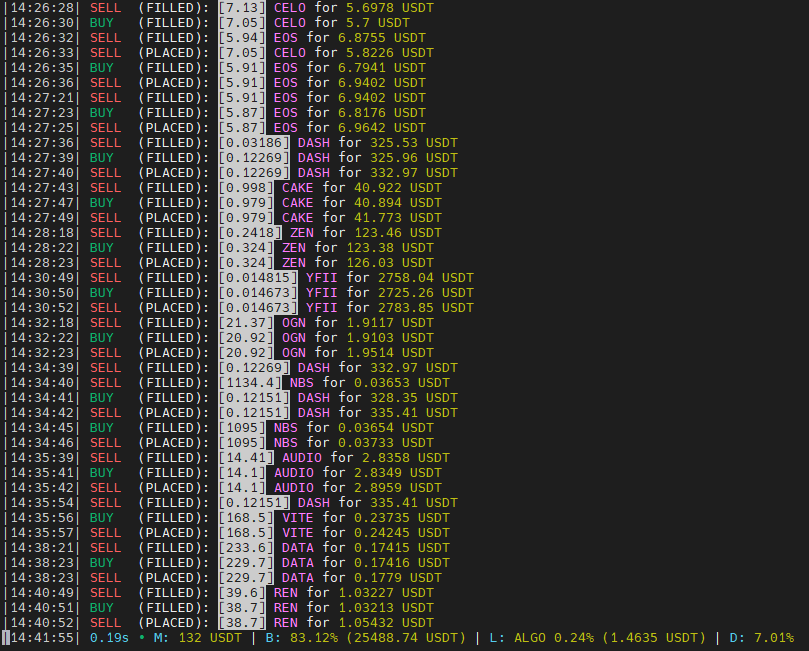  

**IMPORTANT! BOT WORKS ONLY ON ACCOUNTS REGISTERED ON THE DEVELOPER'S REFERRAL LINK!
Binance: [Registration by referral link](https://accounts.binance.com/ru/register?ref=NYGPPWD2)  
Referal ID: `NYGPPWD2`**  
If you have any difficulties with a multi-account, contact **@dpcwee** on Telegram
There is a referral system in the bot: the person you brought can enter the BEP20 wallet from your account. In this case, your account must also be registered using the referral link of the developers.

### Support developers:
`0x7680b3c00923fe29c62fb157e69187a918a076cd` — BEP20 network for any crypto on Binance

### Contacts:  
*[Official Telegram Chat](https://t.me/abot_chat)* — for discussions, communication with developers and project development  

### Useful Resources:
*[abot-config.ru](https://abot-config.ru/?utm_source=github&utm_medium=github&utm_campaign=readme) from *[@YaroslavMolchan](https://t.me/yaroslavmolchan)**  
*[stats.abot.su](https://stats.abot.su/?utm_source=github&utm_medium=github&utm_campaign=panel) from *[@DizzyUp](https://t.me/dizzyup)**

### Useful links:
*[A complete guide to run A-Bot](https://abot-config.ru/help/install?utm_source=github&utm_medium=github&utm_campaign=readme)* — a detailed guide on setting up API, Telegram, creating a server, as well as setting up and running a bot  
*[Google Cloud](https://dpcwee.medium.com/%D0%BF%D0%BE%D0%BB%D1%83%D1%87%D0%B0%D0%B5%D0%BC-%D0%B1%D0%B5%D1%81%D0%BF%D0%BB%D0%B0%D1%82%D0%BD%D1%8B%D0%B5-6-%D0%BC%D0%B5%D1%81%D1%8F%D1%86%D0%B5%D0%B2-google-cloud-1da76f2f62fd)* — guide to get a free server for a bot  
*[Screen commands for the server](http://itautsors.ru/ispolzuem-komandu-screen-v-linux)* — how to make A-Bot work in the background on Linux  
*[A-Bot calculator](https://abot-config.ru/calculator?utm_source=github&utm_medium=github&utm_campaign=readme)* — calculation of future averages based on the buy_down, step_aver and quantity_aver parameters  
*[Averaging calculator](https://abot-config.ru/calculator-mid?utm_source=github&utm_medium=github&utm_campaign=readme)* — calculation of the average purchase price based on the trading history   
*[Compound interest](https://abot-config.ru/calculator-percent?utm_source=github&utm_medium=github&utm_campaign=readme)* — calculation of the return on investment for the selected period  
*[Monthly statistics](https://mega.nz/file/MMpQFYZS#D07V4GnURzAu9oEh6ddDe-JnXym2FOpdI_2obedFhKU)* — Monthly income graph from *Wex3*  
*[Summary Excel table of profitability](https://mega.nz/file/gUwQAQDT#ooSVkOJapIkx4_RN22a3O98upz3DFDftPLEkZseLHrU)* — a table for calculating the profitability of the bot based on the current values of profitability from *[@aeridiph](https://t.me/aeridiph)*  
*[ASS © AntiSignalS](https://t.me/antisignals)* — channel with signals from an active member of the community Bi↯llar'a  

### Forums:
*[Cryptotalk](https://cryptotalk.org/topic/332721-%D0%B1%D0%B5%D1%81%D0%BF%D0%BB%D0%B0%D1%82%D0%BD%D1%8B%D0%B9-%D1%82%D0%BE%D1%80%D0%B3%D0%BE%D0%B2%D1%8B%D0%B9-%D0%B1%D0%BE%D1%82-%D0%B4%D0%BB%D1%8F-binance/)* *[Bits.Media](https://forum.bits.media/index.php?/topic/178120-a-bot-%D0%B1%D0%B5%D1%81%D0%BF%D0%BB%D0%B0%D1%82%D0%BD%D1%8B%D0%B9-%D0%B1%D0%BE%D1%82-%D0%B4%D0%BB%D1%8F-binance/)* *[Bitcointalk](https://bitcointalk.org/index.php?topic=5301070)* *[Mining-Hub](https://mininghub.cc/threads/474/)*

### Description of the strategy:
The bot works according to the averaging strategy. The essence of the strategy is to reduce the average entry price to an asset by increasing the position weight if the asset's market value decreases in relation to the current order value. In other words, when entering a deal, the bot, based on the custom trading settings, places a sell order with a specified percentage of profit, but if the asset value falls in relation to the first purchase, without reaching the sell order, and falls below the specified value in %, the bot cancels the sell order, buys a certain number of coins, which is always more than the number of coins in the previous canceled order, and places a new sell order at the price (`new average buy price` +`% of the desired profit`). Thus, when the market value of an asset falls, the bot constantly analyzes current orders and market data, comparing the conditions of the trading strategy settings and exchange activity, and buys coins in addition, increasing their total volume and reducing the new selling price.

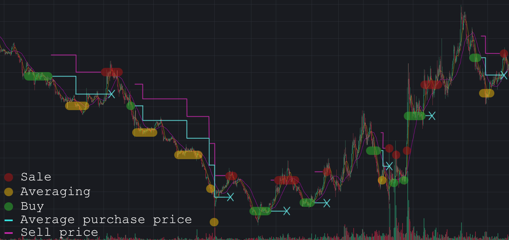  

### Order statuses:
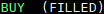 — Buy order executed  
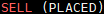 — Placed a sell order  
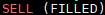 — Sell order is executed, position is closed  
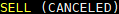 — Sell order canceled for averaging  
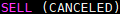 — Sell order canceled and trailing stop activated  
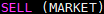 — Partial sale of a position by trailing at the market  
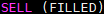 — Full sale of a position by trailing, the position is closed  

### Command parameters:
* `-u` — Update the bot to the latest version 
* `-s` — Run A-Bot
* `-o` — View all positions opened by the bot on the exchange 
* `-m` — Delete, add or reset the parameters of the list of coins allowed for trading 
* `-k` — Change Binance Key API Settings or Telegram Notification Settings 
* `-p` — Change the parameters bots trading parameter
* `-h` — Reset all trading history for pairs from the list of coins allowed for trading. Open positions on the exchange will not be canceled, but will be deleted from the bot's database  
* `-i` — Removing trade statistics will reset the profit indicators and successful trades made by the bot
* `-e` — Safe exit from the bot (in the main menu) / safe stop of trading and exit to the main menu (when the bot is running)  
* `-dlog` — Delete all old logs in the bot folder

### Обозначения информационной консоли:
* `s` — Execution time of the last cycle of the script in seconds
* `•` — Indicator of the difference between the time of the bot and the exchange server, ping  
  * `Green` — Stable connection  
  * `Yellow` — There is a slight lag  
  * `Red` — This color signals a large delay between the time of events on the exchange and messages about these events in the web socket stream.  
* `М` — The maximum number of simultaneously open positions, automatically adjusted by the bot when the corresponding setting is enabled
* `B` — Free balance
* `L` — The asset closest to the sale (`coin name`` the difference between the market price and the price of a sell order in % `(` order price`))  
* `D` — Daily delta of whitelisted pairs as a percentage, conventionally indicating a market trend  

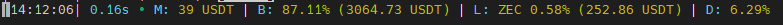  

### Terms of use:
* In order for the bot to start working with a manual order, the asset must be in the allowed list of coins  
* Do not dispose of the assets that the bot is working with. If you see a free balance - check the coin in the terminal, perhaps the bot is working with this coin with trailing activated  

### Starting:
*Windows (only 10 x64))*: Download **[A-Bot.exe](https://github.com/dpcwee/abot/releases/latest)** and run 
*Linux (minimum 18.04)*: Download **[A-Bot](https://github.com/dpcwee/abot/releases/latest)**  
(`wget https://github.com/dpcwee/abot/releases/download/VERSION/A-Bot`,  specify last version instead ***VERSION***),  
give it rights by command `chmod 755 A-Bot`, then run with the command `./A-Bot`  

### Working with screen command on Linux:
1) At the first start / restart of the server, enter `screen -S <name_screen>` (e.g. `screen -S abot`), now we are in the new screen, just run `./A-Bot`  
2) We launched the bot and you can disconnect the connection with the server, the bot will run in the background in the created screen 
4) When reconnecting to the server with existing screens, enter `screen -x` (connect to a single screen) or` screen -x <name_screen> `, if there are several of them, entering the required screen. The `screen -S` command is no longer needed!  
5) In case of server reboot (reboot or other apocalypse), connect to the server and repeat the described cycle from the 1st point  

### Settings API parameters:
* API keys - a pair of API keys (api and secret) to connect to Binance ([API-Management](https://www.binance.com/ru/usercenter/settings/api-management))  
* referral — The ID of your Binance account registered with our referral code ([Referal ID](https://www.binance.com/ru/my/dashboard) — at the top left in your personal account)  
* BEP20-wallet — the address of the person on Binance on the Binance Smart Chain (BSC) who told you about the bot 
* tg_notification — Telegram notifications about closed deals, daily statistics and the current summary in the channel header 
  * tg_token — token issued by [@BotFather] (https://t.me/botfather) after creating a Telegram bot  
  * tg_name — <@name> or <chat_id> to send notifications. The bot created in the previous step must be a member of a group / channel and be its administrator with the options for posting messages and changing the profile enabled  
  * user_id —  id of Telegram account, required to control a trading bot via a Telegram bot, which can be obtained from [@userinfobot] (https://t.me/userinfobot) by writing / start to it or clicking the "Start" button.

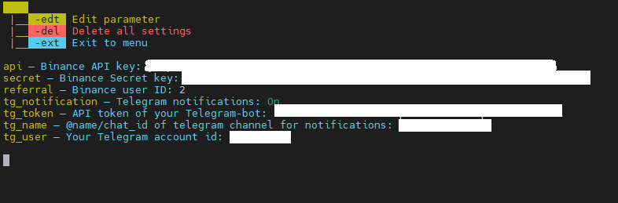  

### How to enable Telegram notifications:
1. We turn to [BotFather] (https://t.me/botfather) in Telegram and create a new bot (enter the command /newbot or select it through the context menu)
2. Enter any bot name
3. Next, come up with a unique username for the bot, which ends in 'bot' (for example *** exambot_abot ***)
4. Upon successful creation, BotFather will send us a message containing a link to the created bot and its API token (for example, 1432166624:AAHSlGrfaFP21BXLihyGXPiUv_urjarJhty). Write the token to a private location
5. Create a public or private channel (Menu -> Create channel), come up with a name for it. Further, if the channel is public, give it an @name (for example ***test_push_abot_channel*** (@name is the name in the link t.me/test_push_abot_channel)), add the previously created bot ***exambot_abot*** to the channel and make it an administrator with the rights to change the channel profile and post messages (the first two checkboxes are administrator options). If the channel is private, you will need to get its chat_id (write any message to your channel and forward it to this bot [@userinfobot] (https://telegram.me/userinfobot). In response, you will receive a message with its chat_id. It will look something like "-100XXXXXXXXXX")
6. Run A-Bot and enable Telegram notifications in the settings of the API and Telegram parameters, then enter the API token that BotFather gave you, @ name/chat_id of your channel, where the Telegram-Bot is located in the administrators, created in step 5 (***@test_push_abot_channel***), and user_id, which can be obtained from [@userinfobot] (https://t.me/userinfobot) by writing /start to it or by clicking the "Start" button
Now, every time a bot completely closes a sell position, you will receive a notification in your channel!

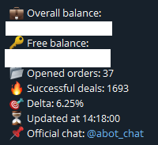  
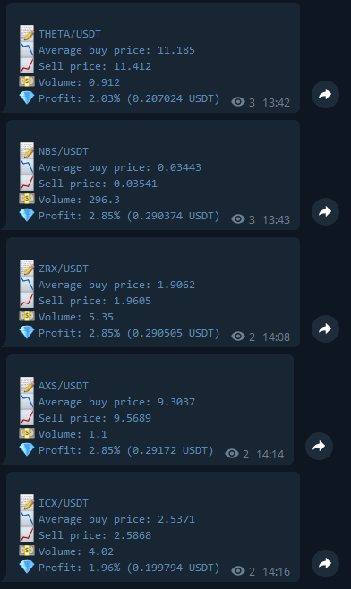  

### Trade parameters:
* `clean_socket` [y/n] — Flush the websocket data stack if the red indicator appears frequently or the bot is slow due to the large number of assets in quote_asset. Leave ***N*** if no problems are observed  
* `timeout_socket` [0-2] — The minimum timeout between stream messages, required for slow machines or poor connections, resulting in freeze orders or free balance. Leave ***0*** if there are no problems
* `name_list` [str] — The name of the current settings preset (after enter -sve command, it will be saved to the list of settings with this name) (for example, main)
* `min_bnb` [min >= 0.01] — The minimum free BNB balance, below which the bot will buy the minimum allowed amount of BNB at the market price to pay the exchange commission (e.g. 0.03)
* `min_balance` [min >= 0] — Do not buy/average positions if the free balance is less than the specified % of the total balance (e.g. 15)
* `min_order` [min >= 1] — The multiplier of the size of the first buy order. The cost of the first order will be calculated as **the minimum allowable order size on the exchange * min_order** (e.g. 1.2). On USDT it's $10, on BTC it's 0.0001. Limits can be found [here](https://www.binance.com/ru/trade-rule)  
* `min_price` [min >= 0.00000001 USDT] — The minimum market value of a coin, the equivalent in USDT of which is equal to **the market rate of the coin in USD**, below which the bot will not open new deals for this pair, only average if there is a sell order (for example, 0.05)
* `min_daily_percent` [-100 < min < daily_percent < 99999] — Above what value the % of daily price change on the exchange should rise in order for the bot to make the first purchase for a pair (e.g. -20)
* `daily_percent` [-100 < min < 99999] — Below what value the % of daily price change on the exchange should fall in order for the bot to make the first purchase for a pair (e.g. -3) 
* `sell_up` [min > 0.15] — Desired % of profit from selling excluding daily delta and trailing stop (e.g. 1.65)  
* `buy_down` [min < 0] — How many % should the market price of an asset fall in relation to the price of its last purchase for the bot to average the position (for example, -5)
* `max_trade_pairs` — The allowed number of sell positions that the bot can keep open at the same time (e.g. 20). If the number of orders opened by the bot becomes equal to or greater than **max_trade_pairs**, the bot will stop making new purchases (except for averaging)
  * `-1` [-1] — Do not limit the number of pairs traded by the bot at the same time 
  * `0` [0] — Work only with already open orders and do not make new purchases  
  * `1 or more` [1-999] — Specify the maximum number of positions manually
* `auto_trade_pairs` [y/n] — Specify the maximum number of positions manually Allow the bot to automatically adjust the number of allowed pairs? If ***Y***, the bot will automatically adjust the maximum number of simultaneously traded pairs, if the previous settings parameter was manually set by the user from 1 to 999  
* `delta_percent` [y/n] — Use the total market daily price delta? If ***Y***, sum the trading parameters with the total daily delta (market direction) for the selected pairs from the white list. This parameter will make the strategy more flexible, but may reduce profits.  
* `delta_deep` [y/n] — Use delta dip depth to determine market dip and buy/average pause? If ***Y***, then the bot will block new purchases and averaging in a falling market until a local rebound of the entire market occurs. The definition of a local rebound depends on the magnitude of the fall of the delta itself and is expressed in a ratio of 1 to 10 (with a delta of -5, the bot will begin to open positions when the delta grows to -4.5 and higher)  
* `num_aver` [y/n] — Use an averaging grid? If ***Y***, then during averaging, the bot will increase the percentage of price drop required for a new asset averaging by **buy_down** + (**1** + **the number of averages**) * **step_aver** 
  * `step_aver` [%] — The step of increasing the grid. By what percentage to increase the subsequent difference between the market price and the price of the last purchase for averaging (e.g. 1.35)  
* `max_aver` [min >= 0] — The maximum number of averaging on one position (for example, 4)
* `quantity_aver` [min >= 1] — The multiplier of the averaging size from the current position weight (for example, 2). In other words, when averaging, the bot will buy **the current number of coins** * **quantity_aver**, thus the new position will be equal to **the current number of coins** * **quantity_aver** + **the current number of coins**. It is not recommended to make this parameter lower than 2  
* `trailing_stop` [y/n] — Use a trailing stop? If ***Y***, push back the selling price depending on the movement of the asset price. With trailing enabled, the position is not closed immediately, but sold in parts **trailing_part** at prices close to the maximum values in order to increase potential profit, or it is closed completely when the price falls and approaches the average buy price. This parameter will make the strategy more flexible, but may reduce profits. 
  * `trailing_percent` [min > 0] — At what fall from the local high-level of the price to activate a trailing stop for a partial/full sale (e.g. 0.25)
  * `trailing_part` [100 >= min >= 0] — The size of the partial sale by trailing in % of the total weight of the position (e.g. 10)
  * `trailing_price` [min >= 0.00000001 USDT] — Activate a trailing stop only on assets with a USD equivalent value above the specified percentage. This allows you to avoid negative trades due to too large a spread percentage of coins with a low value (for example 0.2)  
* `user_order` [y/n] — Working with custom orders after manual purchase. If ***Y***, then if the user buys a coin from the allowed list, the bot will automatically put the purchased amount of coins for sale and will work with this pair in the same way as in other cases, focusing on the trading settings. Also, already open orders can be averaged manually: for this, while the bot is running, buy the required number of coins, after which the bot will cancel the sell order, calculate new data and place an order at a new price 
* `fiat_currencies` [RUB UAH ...] — If Telegram notifications are enabled, then daily trading statistics will be calculated in these currencies together with **quote_asset**  
* `quote_asset` [USDT BTC ...] — Quoted currencies for trading (that is, those currencies in which the coins from the allowed list are traded (ADA/**USDT**, ADA/**BTC**), and not which are traded to them)
* `double_asset` [y/n] — If ***Y***, the bot will be able to buy the same coin on multiple quoted assets (**ADA**/USDT and **ADA**/BTC) 

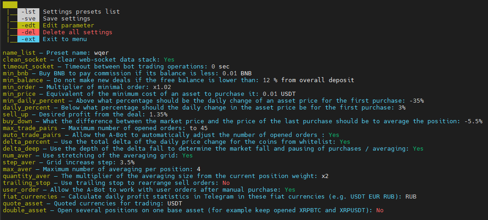  
