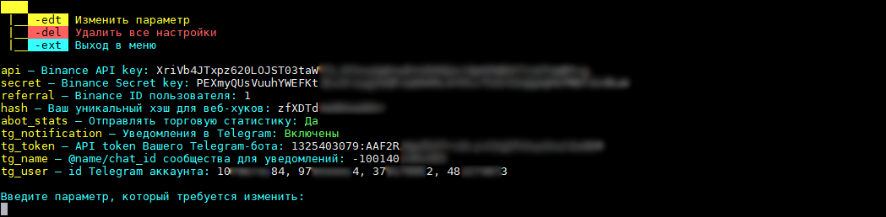
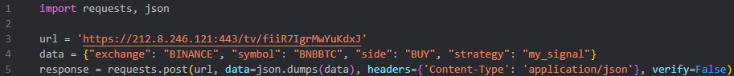
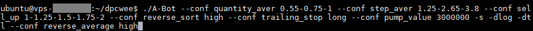

## A-Bot [[EN](https://github.com/dpcwee/abot)]  

A spot bot for algorithmic multivurrency trading on the Binance exchange, supporting both manual and fully automated trading.  

  
  

**The bot is free to use for Binance accounts registered through the developer's referral link. For other users, there is a subscription fee for the convenient use of the bot, which will be described later.  
New users who are not developers' referrals receive a $10 bonus upon the bot's first launch.  
Binance: [Registration through the referral link](https://accounts.binance.com/en/register?ref=C2GCPXJA)  
Referal ID: `C2GCPXJA`**  

### Referral program
A **`multilevel referral program`** exists in the bot: the person you invite can specify a BEP20 wallet from your Binance account or your unique 6-digit referral code, which is visible in the main menu of the bot or in the statistics tab of your personal Telegram bot. The current percentage paid to users from the first-level referral trading commissions received by the developers is 15%. Referral providers can also receive up to 7% for other levels in their referral tree. As a result, the total percentage of referral payments can be up to 22%. Payments are made every Saturday, reports of which are published in the [announcements Telegram channel](https://t.me/abot_announcements).  

### Balances replenishment:
Due to the update of the API trading policy on Binance as of August 23, 2021, trading via API will only be possible on accounts that have passed intermediate verification. For the bot to work on accounts that are not registered through the developer's referral link, there is a system of useful payment for the transactions performed by the bot, which is 0.015% of their size. New users automatically receive a $10 bonus that is visible in their personal Telegram bot. In the future, if there are no funds in the A-Bot account, the bot's work will be automatically suspended; therefore, do not forget to keep track of your balance. To replenish the A-Bot balance, you need to configure the Telegram bot according to the ***[instructions](https://abot-trade.ru/payment)*** and replenish the balance with any USD token for the desired amount, following the transfer instructions. When replenishing the balance, a bonus of up to 50% is credited when the balance is replenished up to $400; above this amount, the bonus remains fixed at 50%.  

**Users registered through our referral link will continue to use the tool for free.**  

### Contacts:
*[Official Telegram chat](https://t.me/abot_chat)* — for discussions, communication with developers, and project development.

### Useful links:
*[USDT-bots statistics](https://t.me/abot_stats_usdt)*, *[BTC-bots statistics](https://t.me/abot_stats_btc)*  
*[Complete guide on bot launch](https://abot-trade.ru/registration)* — a detailed guide on setting up API, Telegram, creating a server, and configuring and launching a bot  
*[Manual on trading settings for the bot](https://dpcwee.medium.com/%D1%80%D0%B0%D1%81%D1%88%D0%B8%D1%80%D0%B5%D0%BD%D0%BD%D1%8B%D0%B9-%D0%BC%D0%B0%D0%BD%D1%83%D0%B0%D0%BB-%D0%BF%D0%BE-%D0%BD%D0%B0%D1%81%D1%82%D1%80%D0%BE%D0%B9%D0%BA%D0%B0%D0%BC-%D0%B8-%D1%80%D0%B0%D0%B1%D0%BE%D1%82%D0%B5-a-bot-98dcc2dcdc38)* — an extended instruction on each setting of the bot with visual examples  
*[Table for averaging calculation](https://mega.nz/file/IUQ3ybrQ#hsaJ_fNY9JVCss-fFlBLnITqzUx7-sqdyBz1R5p7StU)* — a table for calculating the price and volume of orders for averaging by *[@dpcwee](https://t.me/dpcwee)*  

### Strategy description:
The bot operates on the averaging strategy. The essence of the strategy is to reduce the average entry price into an asset by increasing the weight of the position if the market value of the asset falls relative to the current order price. In other words, when entering into a trade, the bot, based on user trading settings, places a sell order with a specified profit percentage. However, if the asset value falls relative to the first purchase without reaching the sell order and drops below a certain percentage value, the bot cancels the sell order, buys a certain number of coins based on the trading settings, and places a new sell order at the price (new average purchase price + desired profit percentage). Thus, in the event of a market value drop of the asset, the bot constantly analyzes the current orders and market data, compares the conditions of the trading strategy settings and exchange activity, and buys coins, increasing their total volume and reducing the new selling price. 

  

### Designations of order status:
 — Buy order fulfilled  
 — Sell order placed  
 — Sell order fulfilled, position closed  
 — Sell order canceled for averaging  
 — Sell order canceled and trailing stop activated  
 — Partial position sale by trailing market  
 — Full position sale by trailing, position closed  

### Launch keys:
* `-s` — Direct launch of the bot bypassing the main menu  
* `-ud` — Enable the ability to add UP/DOWN tokens to the allowed coins list  
* `-uo` — Activate manually placed sell orders (there should be no position open by the bot on the asset). Experimental feature!  
* `-snl` — Sell free coins on the balance to the priority of the quote_asset asset immediately after this trading pair is listed on Binance  
* `-tld` — Launch the bot on the Binance US account  
* `-dtl` — Remove @abot_chat from the header of the personal Telegram channel with statistics  
* `-nlb` — Do not send information about purchasing BNB for commission to the bot console and personal Telegram channel  
* `-api`, `-secret` and `-referral` — Reset corresponding settings when launching the bot  
* `-wlinit` — Dynamic White List of coins. Every minute, the bot will update the list of allowed coins from the wlinit.txt file (which must be created beforehand; coins must be listed on one line separated by spaces, for example BTC ETH BNB). Useful in case you have any indicators and want to constantly automatically filter coins for trading  
* `--conf` — Configuration key, which can be found in more detail *[at the bottom of the page](#key---conf)*  

### Command keys:
* `-s` — Start the bot  
* `-u` — Update the bot to the latest version if available
* `-m` — Remove, add, or reset parameters for the allowed coins list for trading  
* `-k` — Change API key settings for Binance or Telegram parameters  
* `-p` — Change trading and bot operation parameters  
* `-h` — Reset all trading history for pairs from the allowed coin list. Open positions on the exchange will not be cancelled, but will be deleted from the bot's database  
* `-i` — Deleting trading statistics will reset profitability and successful trades made by the bot  
* `-e` — Safe exit from the bot (in the main menu) or safe stop of trading and exiting to the main menu (when the bot is running)  
* `-dlog` — Remove all old logs in the bot folder  
* `-sat` — Sell all free or lost coins (with status SELL_ORDER and NO_ORDER) and convert dusty remains into BNB  
* `-auto` — Automatically calculate trading parameters based on the total asset balance specified in quote_asset  

### Information console designations:
* `s` — Execution time of the last script cycle in seconds  
* `•` — Trading script processing speed indicator  
  * `Green` — Fast processing  
  * `Yellow` — There is a slight delay  
  * `Red` — This color indicates a large number of unprocessed exchange operations in the data stack, indicating a lack of computing resources on the machine  
* `PD` — Pump detector  
  * `Green` — Activated, monitoring the market  
  * `Yellow` — Activated, but there is a slight delay in the pump detector stream from the current time  
  * `Red` — Bot is unable to process the pump detector stream due to a weak machine/connection  
* `M` — Maximum allowed number of open positions at the same time  
* `B` — Free balance  
* `L` — The closest asset to sell (`coin name`, `the difference between the market price and the order price for sell in %` (`order price`))  
* `D` — Daily delta of pairs from the whitelist in percentages, conditionally indicating the market trend  
  * `Yellow` — Positive delta; settings do not block purchases/averages  
  * `Purple` — Delta is negative or positive; if there are several assets for trading in quote_asset, it indicates blocking of purchases/averages for one/multiple of them  
  * `Red` — Negative delta; settings block purchase/average for all assets from quote_asset  

  

### Recommendations:
* To start working with a manual order, the asset must be on the allowed list of coins  
* Do not dispose of assets that are currently in use by the bot. If you see a free balance, check the coin on the terminal; it is possible that the bot is using it with activated trailing  
* In case of arranging manual purchase orders with a grid, there should be a reserve between orders of 1-2% to account for squeezes. If several orders are triggered simultaneously, the bot may not consider the last one  
* The recommended minimum deposit for comfortable bot operation in any market is $1000-2000  
* We strongly recommend setting up a Telegram bot to manage A-Bot and view the necessary statistics  

### Launch:
*Windows (>8, >Server 2012)*: 
> Download **[A-Bot.exe](https://github.com/dpcwee/abot/releases/latest)** and run the program  

*Linux (Ubuntu >18.04; Debian >9; CentOS >8)*: 
> In the terminal, enter the command 
`sh -c "$(curl -fsSL abot-trade.ru/A-Bot.sh)"` (this command will automatically update the system packages, download the bot, give it permissions, and install a window manager (screen) for background operation of the bot). After executing this command, you will be in a screen already created with the name "A-Bot". To start the bot, enter `./A-Bot`  
**OR**  
Download **[A-Bot](https://github.com/dpcwee/abot/releases/latest)** (in the terminal on the server, enter the command  
`wget https://github.com/dpcwee/abot/releases/download/VERSION/A-Bot`, where instead of ***VERSION*** specify the latest version),  
give it permissions with the command `chmod 755 A-Bot`, and then create a screen window (instructions below) if it is not already created (check for the presence of screens with the command `screen -ls`), and then start the bot with the command `./A-Bot`

### Update:
> When a new version is released, within an hour a new key command `-u` will appear in the main menu of A-Bot for updating; also in your Telegram bot (through which you manage the trading bot and which is responsible for push messages to your Telegram channel) a new button `Update A-Bot` will appear (when updating through Telegram, the bot will restart and start trading automatically)

**OR**
> *Windows*: Close the bot and download the new version to the directory with the old file (overwriting)  

> *Linux*: Access the screen with the bot using the `screen -x` command and stop the bot with the `-e` command, then in the directory with the A-Bot file, enter the command to remove the old version  
`rm A-Bot`, then enter the command  
`wget https://github.com/dpcwee/abot/releases/download/VERSION/A-Bot`, where instead of ***VERSION*** you indicate the latest version, then give permission to the file with  
`chmod 755 ./A-Bot` and start it with the command `./A-Bot`  

### Working with screen on Linux:
To make the bot work in the background on the server 24/7, you need to install the screen utility designed for this purpose. After connecting to the server, enter the commands apt update, then `apt-get install screen` and press Enter or Y if prompted by the terminal to update system packages and install the window manager (screen). We won't need these commands anymore!  
1) Enter `screen -S <name_screen>` (for example, `screen -S abot`), enter a new screen and run `./A-Bot` (if the A-Bot file is located in the home directory, otherwise first go to the directory with it with the command `cd directory_with_bot`  
2) The bot has been launched, and you can disconnect from the server. The bot will work in the background in the created screen.  
3) When reconnecting to the server with existing screens, enter `screen -x` (connection to a single screen) or `screen -x <name_screen>` if there are several, to enter the screen you need. The command `screen -S` is no longer needed!  
4) In case of server reboot or other apocalypse, connect to the server and repeat the cycle described in step 1.  
Now you can disconnect from the server — A-Bot will work regardless of the active connection session.

### API configuration parameters:
* `API Keys` — A pair of API keys (`api` and `secret`) to access Binance ([API-Management](https://www.binance.com/en/usercenter/settings/api-management))  
* `referral` — Your account ID on Binance ([User ID](https://www.binance.com/en/usercenter/dashboard) — top left in the personal account)  
* BEP20 wallet — Person's address on Binance in the Binance Smart Chain (BSC BEP20) who told you about the bot  
* `hash` — Your personal hash for the bot to work with signals from TradingView or POST requests  
* `tg_notification` — Telegram notifications about closed deals, daily statistics, and the current summary in the channel header  
  * `tg_token` — Token issued by [@BotFather](https://t.me/botfather) when creating a Telegram bot  
  * `tg_name` — <@name> or <chat_id> for sending notifications. The bot created in the previous step must be a member of the group/channel and be its administrator with the ability to publish messages and change the profile  
  * `user_id` — Telegram account ID needed to manage the trading bot through the Telegram bot, which can be obtained from [@userinfobot](https://t.me/userinfobot) by writing /start or clicking "Start".  

  

### Telegram Setup:
**[Instructions on setting up a Telegram bot and channel](https://abot-trade.ru/connection)**  
Every time the bot completely closes a sell position, you will receive a notification in your channel.  
If your personal Telegram bot is not responding to messages, try: writing `/start` to the Telegram bot, checking its functionality, or restarting A-Bot.

  
  

### TradingView or custom signals:
The bot supports working with signals from TradingView, as well as accepting signals when sending a POST request to our server. You can select/create your own indicator and send commands to A-Bot using webhooks to work with assets, which, in turn, will take this asset into its work according to its trading algorithms and user settings.  
> Server URL for sending signals that sends signals to individual bots via websockets: *https://212.8.246.121:443/tv/hash*. You will find the **hash** in the API and Telegram settings (`-k` in the A-Bot main menu).  

> The entire signal body must be wrapped in curly braces **{}**.

* Each signal must contain mandatory keys without which the bot cannot react to it:
  * `'exchange'` ['{{exchange}}'] — The exchange for which the signal is intended (in the case of the bot, this is the only platform 'BINANCE')  
  * `'symbol'` ['{{ticker}}'] — The trading pair on which the signal was received  
  * `'side'` ['{{strategy.order.action}}'] — The signal to buy or sell (the direction must be indicated as 'BUY' or 'SELL'). If the signal type is 'BUY' and there is no position open on this asset yet, the bot will open an order based on the trading parameters. To close a position based on the 'SELL' signal, the webhook message must include the 'take_profit' or 'stop_loss' key with a value of 'true'  
  * `'strategy'` ['NAME'] — Any name of your strategy, including spaces, numbers, and symbols  

> *{**"exchange": "{{exchange}}", "symbol": "{{ticker}}", "side": "BUY", "strategy": "my_signal"**}*  

* Optional keys, which can be an addition to your strategy (several keys can be in one signal or all at once):
  * `'take_profit'` ['true'] — Sell the asset if there is already a sell order open on it, and the position *is in profit* (otherwise, ignore)? *{"exchange": "{{exchange}}", "symbol": "{{ticker}}", **"side": "SELL"**, "strategy": "my_signal", **"take_profit": "true"**}*  
  * `'stop_loss'` ['true'] — Sell the asset based on stop-loss. The position will be closed at a loss if the market value of the asset is below the average entry price! {"exchange": "*{{exchange}}", "symbol": "{{ticker}}", **"side": "SELL"**, "strategy": "my_signal", **"stop_loss": "true"**}*  
  * `'averaging'` ['true'] — In case a position *is already open* on the asset (otherwise, ignore), after receiving a signal with this key, the bot will average it based on the trading parameters. *{"exchange": "{{exchange}}", "symbol": "{{ticker}}", **"side": "BUY"**, "strategy": "my_signal", **"averaging": "true"**}*   
  * `'min_order'` ['NUMBER'] — If there is *no position open* on the asset yet (otherwise, ignore), the size of the min_order is taken from the signal, not the trading parameters. *{"exchange": "{{exchange}}", "symbol": "{{ticker}}", **"side": "BUY"**, "strategy": "my_signal", **"min_order": "3.25"**}*  
  * `'sell_up'` ['NUMBER'] — When buying/averaging a position based on the signal, the size of the sell_up is also taken from it instead of the value from the trading parameters. If there is already an open position on the asset, the bot will simply re-place this order with the sell_up from the signal (in this case, the signal must not contain the 'averaging' and 'stop_loss' keys). *{"exchange": "{{exchange}}", "symbol": "{{ticker}}", **"side": "BUY"**, "strategy": "my_signal", **"sell_up": "2.5"**}*  

  

> Code for sending POST requests in Python: 

    import requests, json
    
    url = 'https://212.8.246.121:443/tv/hash'
    data = {"exchange": "BINANCE", "symbol": "BNBBTC", "side": "BUY", "strategy": "my_signal"}
    response = requests.post(url, data=json.dumps(data), headers={'Content-Type': 'application/json'}, verify=False)
    
  

### Trading parameters:
* `min_bnb` [min >= 0.01] — The minimum free BNB balance below which the bot will buy the minimum allowed amount of BNB at the market price to pay for exchange commission (e.g. 0.03)  
* `min_balance` [100 >= min_balance >= 0] — Do not buy/average positions if the free balance is less than the set % of the total balance (e.g. 15)  
* `position_size` [100>= position_size > 0] — The maximum allowed size of one position as a % of the total deposit. If after averaging the position, the position size exceeds the position_size value of the total deposit, the bot will not average such a position (e.g. 20)  
* `min_order` [min >= 1] — The multiplier of the first buy order size. The cost of the first order will be calculated as the **minimum allowable order size on the exchange (on USD it's 10$, on BTC it's 0.0001)** * **min_order**. Limits can be found [here](https://www.binance.com/en/trade-rule) (e.g. 1.2)  
* `row_sell` [10 >= row_sell >= 1] — By how many times can the bot increase the **min_order** multiplier when opening a position, if the previous deal with this pair was closed without averaging and within the set **row_timer** time (default is 3600 seconds)? (e.g. 3)  
* `min_price` [min >= 0.00000001] — The minimum market value of the coin, the equivalent in USD of which is equal to the **market rate of the coin in USD**, below which the bot will not open new deals for this pair, only average if there is a sell order (e.g. 0.05)  
* `min_daily_percent` [-100 < min_daily_percent < daily_percent <= 99999] — At what value should the % daily price change indicator on the exchange rise so that the bot makes the first purchase for the pair (e.g. -20)  
* `daily_percent` [-100 < daily_percent <= 99999] — At what value should the % daily price change indicator on the exchange fall so that the bot makes the first purchase for the pair (e.g. -3)  
* `auto_daily_percent` [y/n] — Use the total daily delta of the allowed coin list instead of **daily_percent** to limit the maximum purchase corridor percentage. If ***Y***, the bot will not buy coins that have grown more than `D` % from the console information line  
* `order_timer` [min >= 0] — Interval pause between closing a deal and making a new purchase for the same pair in seconds (e.g. 5)  
* `min_value` [min >= 0] — The equivalent of the minimum daily trading volume in USD for the trading pair to open a position for it (e.g. 100000)  
* `sell_up` [min > 0] — Desired profit % from the sale excluding daily delta and trailing stop (e.g. 1.65)  
* `sell_count` [y/n] — First of all, open positions for the most frequently traded pairs with the largest number of trades
* `buy_down` [min > 0] — By how much % should the market price of the asset fall relative to the price of its last purchase for the bot to average the position (e.g. -5)  
* `max_trade_pairs` — The maximum number of sell positions that the bot can keep open at the same time (e.g. 20). If the number of orders opened by the bot becomes equal to or more than **max_trade_pairs**, the bot will stop making new purchases (except for averaging already opened positions)  
  * -1 [-1] — Do not limit the number of pairs traded by the bot at the same time  
  * 0 [0] — Work only with already opened orders and do not make new purchases  
  * 1 and more [1-999] — Specify the maximum number of positions manually  
* `auto_trade_pairs` [y/n] — Allow the bot to automatically adjust the allowed number of pairs? If ***Y***, the bot will automatically adjust the maximum number of pairs traded simultaneously if the previous settings parameter is manually set by the user from 1 to 999  
* `progressive_max_pairs` [y/n] — Use progressive reduction of the maximum number of pairs. If ***Y***, the number of pairs when the **auto_trade_pairs** option is enabled will automatically decrease not only depending on the ratio of free and total balance, but also on the number of open orders and the total number of their averages  
* `delta_deep` [y/n] — Use delta drop depth to determine market drop and buy/averaging pause? If ***Y***, the bot will block new buys and averaging on a down market until a local rebound of the entire market occurs. The definition of local rebound depends on the magnitude of the delta drop and is expressed in a ratio of 1 to 10 (at delta -5, the bot will start opening positions when the delta rises to -4.5 or higher)  
* `individual_depth` [y/n] — Use the depth of asset delta to determine individual drops and buy/averaging pause by analogy with **delta_deep**, but separately for each trading pair  
  * `step_aver` [min >= 0] — The step increase of averaging grid in %. By how many percent to increase the subsequent difference between the market price and the last purchase price for a new averaging without considering buy_down. The averaging grid in the database is 0 with no averaging and increases by the value of step_aver % for each averaging (e.g. 1.35)  
* `max_aver` [min >= 0] — The maximum number of averagings on one coin (e.g. 4)  
* `quantity_aver` [min > 0] — The multiplier of the averaging size based on the current position weight (e.g. 2). In other words, when averaging, the bot will buy the **current number of coins** * **quantity_aver**, thus the new position will be equal to the **current number of coins** * **quantity_aver** + **current number of coins**  
* `average_percent` [100 > average_percent >= sell_up] — The maximum desired % difference between the market price and the average entry price after averaging (e.g. 7). The bot will independently find the volume for averaging and make it such that after averaging, the average entry price into the position is not above the average_percent % of the current market price (that is, the price of the new averaging). In other words, after averaging, the sell order will be above the current market price at **average_percent** + **sell_up** % (without considering other dynamic settings that affect sell_up)  
* `trailing_stop` [y/n] — Use trailing stop? If ***Y***, move the selling price depending on the asset price movement. With trailing stop enabled, the position is not closed immediately, but is sold in parts at **trailing_part** prices, which are close to the maximum values, in order to increase potential profit, or is completely closed when the price falls and approaches the average purchase price. This parameter makes the strategy more flexible, but may reduce profit  
  * `trailing_percent` [min > 0] — At what drop from the local high-level asset price to activate trailing stop for partial/full sale (e.g. 0.25)  
  * `trailing_part` [0 < trailing_part <= 100] — The size of partial sale by trailing stop in % of the total position weight (e.g. 10)  
  * `trailing_value` [min >= 1] — The minimum value of the position in USD equivalent required to activate the trailing stop (e.g. 50)  
* `new_listing` [y/n] — Open positions for assets that have just been added to the exchange? If ***Y***, the bot will buy coins immediately after they are listed and ignore trading parameters such as min_value, min_price, daily_percent, and others, except for min_balance and double_asset (by default, the new_listing status is assigned for 3600 seconds and is reset if there were no max_buy_listing sales during this time)  
  * `listing_order` [min >= 1] — The multiplier of the minimum order on the pair during listing (e.g. 3.3)  
  * `max_buy_listing` [0 <= max_buy_listing <= 999] — How many times can the bot open positions for an asset that has just been added to the exchange, ignoring trading parameters? After exceeding this value, the bot will not open a position for this asset until the conditions on the trading pair correspond to the trading settings (e.g. 5)  
* `user_order` [y/n] — Working with user orders after manual purchase. If ***Y***, then in case the user buys a coin from the allowed list, the bot will automatically put up for sale the purchased amount of coins and will work with this pair as well as in other cases, relying on trading settings. Also, already open orders can be manually averaged: for this, during the bot's operation, buy the required amount of coins, after which the bot will cancel the sell order, recalculate the new data, and place the order at the new price  
* `reinvest_position` [y/n] — Release parts of the position in the investment by means of other profitable trades. If active, the bot will direct part of the profit from sales to the stuck losing heavy positions for gradual release of their volume  
* `reinvest_percent` [0 < reinvest_percent <= 100] — What percentage of the profit to direct to re-investment in stuck positions? (e.g. 75)  
* `fiat_currencies` [RUB UAH ...] — If notifications are enabled in Telegram, the daily trading statistics will be calculated in these currencies along with **quote_asset**  
* `quote_asset` [USDT BTC ...] — Quoted currencies for trading (i.e. those currencies in a pair against which coins from the allowed list are traded (ADA/**USDT**, ADA/**BTC**), not those traded against them). The priority of quoted assets for primary purchase corresponds to their location (from left to right)  
* `double_asset` [y/n] — If ***Y***, the bot will be able to buy the same coin on multiple quoted assets simultaneously (**ADA**/USDT and **ADA**/BTC)  
* `pump_detector` [y/n] — Use pump detector to open positions? If ***Y***, the bot will analyze all coins from the allowed list in real time and, in case of a volume spike, buyer dominance, and asset price growth, will immediately buy the coin  
* `pump_order` [min >= 1] — The multiplier of the purchase size for the pump detector signal (e.g. 2.5)  
* `pump_up` [min > 0] — Desired % profit from selling a position opened or averaged upon a pump detector signal, excluding daily delta and trailing stop (e.g. 0.35)  
* `max_pump_pairs` [min >= 0] — The maximum number of positions for sale opened upon a pump detector signal that the bot can keep open simultaneously (e.g. 10)  
* `trailing_pump` [y/n] — Use a trailing stop on orders opened upon a pump detector signal? If ***Y***, the bot will activate trailing on such orders according to the parameters of the trailing_stop  
* signals [y/n] — Accept trading signals from TradingView or POST requests via webhooks  
* max_signals [0 < signals <= 999] — The maximum number of positions opened upon signals  

### Key --conf:
All of them are activated via a common key --conf either by entering the keys when starting the bot (for example, ./A-Bot --conf sell_up 1-2 --conf mpp 5) or via a personal Telegram bot in the Trading settings (by entering --conf sell_up 1-2, then on a new line --conf mpp 5). Active keys are also visible in the Trading settings of the Telegram bot. To delete key(s) without restarting the bot, enter --conf KEY_NAME(S) in the Trading settings of the Telegram bot.

***Simple ones — with one/few static values***

* `mop` (activated by the command ***--conf mop NUMBER***) — Automatically calculate the min_order based on the free balance if progressive_max_pairs is enabled, otherwise based on the total balance. The bot will make the minimum order such that it works only with the specified NUMBER % of the free/total balance

* `mlp` (activated by the command ***--conf mlp NUMBER***) — Automatically calculate the listing_order based on the free balance if progressive_max_pairs is enabled, otherwise based on the total balance. The bot will make the minimum order during listing such that it works only with the specified NUMBER % of the free/total balance

* `mpp` (activated by the command ***--conf mpp NUMBER***) — Automatically calculate the pump_order based on the free balance if progressive_max_pairs is enabled, otherwise based on the total balance. The bot will make the minimum order of the Pump Detector such that it works only with the specified NUMBER % of the free/total balance

* `reverse_sort` (activated by the command ***--conf reverse_sort high***) — Reverse sorting mode by priority of opened positions (not from the most losing, but from the highest growth during the day)

* `reverse_average` (activated by the command ***--conf reverse_average high***) — Reverse sorting mode by priority of averaging positions (averaging from the least losing positions to the farthest positions)

* `trailing_stop` (activated by the command ***--conf trailing_stop long***) — Long trailing of positions (without stop-loss trigger, position selling will occur in parts by trailing_part until coins in the position run out)

* `row_sell` (activated by the command ***--conf row_sell reset***) — Reset rowSell multiplier to x1 instead of reducing it by the number of averages in the last sale

* `stop_loss` (activated by the command ***--conf stop_loss NUMBER***) — Enable stop-loss to exit positions if the market price of such assets has fallen by NUMBER% relative to the average entry price

* `listing_timer` (activated by the command ***--conf listing_timer NUMBER***) — After how many seconds (default is 3600) to remove the coin from the new_listing status after listing the pair, if the number of sales has not reached max_buy_listing since the pair was listed

* `row_timer` (activated by the command ***--conf row_timer NUMBER***) — Reset the row_sell multiplier of the position if its length is greater than the specified time in seconds (default is 3600)

* `pump_value key` (activated by the command ***--conf pump_value NUMBER***) — The minimum daily trading volume in USD equivalent to open a position based on a pump detector signal

* `pump_signal key` (activated by the command ***--conf pump_signal qm1-q2-q1...***, where q1, q2, q3, qm1, qm2, qm3 are the types of signals detected by the pump detector) — The pump detector will only work based on the signal types specified in the key

* `daily_percent` (activated by the command ***--conf daily_percent [MIN:MAX/MIN:MAX/...]***) — Several ranges for the min_daily_percent parameter (***MIN***) and daily_percent (***MAX***) with the delimiter ***:*** between the minimum and maximum values, listed through ***/***. The order of listing does not matter and the number of ranges is unlimited

* `super_list` (activated by the command ***--conf super_list ADA-XRP-BNB-...-n***, where coins are separated by a hyphen and the number of coins is unlimited) — The user's super-list of coins that are exempt from trading settings for buying (except for double_asset and min_balance). In other words, when a coin from the super-list is sold, the bot will not analyze trading parameters and restrictions that would prevent the bot from opening a position again on that coin and will buy it immediately after the sale (a certain infinite trading).

***Grid-based - each number in the series corresponds to a quantitative averaging index for the position***

* `step_aver` (activated by the command ***--conf step_aver 2.25-5-3-...-n***) — A manual grid of percentage step_aver, which increases by a specified number for each averaging.

> Instead of specifying one value for the step_aver, which is added to the overall grid for each averaging, you can specify your own values. The hyphens are used to separate the numbers indicating their index in the averaging (after buying a coin, it needs to fall by buy_down% + 0% (the averaging grid is currently zero as there have been no averages) for the first averaging, for the second averaging by buy_down + 0 + NUMBER[2.25], for the third by buy_down + 2.25 + NUMBER[5], for the fourth by buy_down + 7.25 + NUMBER[3], and so on). The numbers are separated by hyphens and may have a remainder, and the number of values is unlimited. If the averaging number exceeds the number of indexes in the numerical series, the step_aver parameter is taken from the settings.

> The other grid keys work similarly.

* `average_percent` (activated by the command ***--conf average_percent 5-7-9.5-...-n***) — A manual grid of percentage average_percent that controls the averaging volume based on the difference between the market price and the new average entry price after averaging

* `quantity_aver` (activated by the command ***--conf quantity_aver 1-1.5-2-...-n***) — A manual grid of averaging volume multiplier quantity_aver for each averaging

* `sell_up` (activated by the command ***--conf sell_up 1.15-0.95-0.77-...-n***) — A manual grid of percentage desired profit from selling the asset, depending on the number of averages in the position

* `pump_up` (activated by the command ***--conf pump_up 0.35-0.55-0.4-...-n***) — A manual grid of percentage desired profit from selling assets opened by the Pump Detector

* `buy_down` (activated by the command ***--conf buy_down 2.15-3.55-4.8-...-n***) — A manual grid of percentages for the asset price drop from the price of the last purchase/averaging, necessary to perform a new averaging

* `trailing_percent` (activated by the command ***--conf trailing_percent 0.15-0.55-0.8-...-n***) — A manual grid for the desired trailing percent, depending on the number of averages in the position

