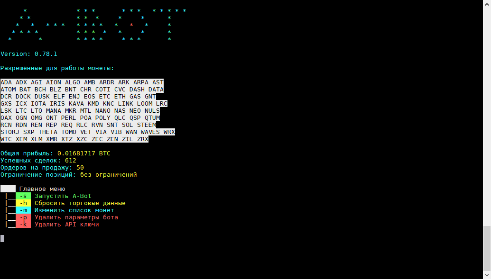
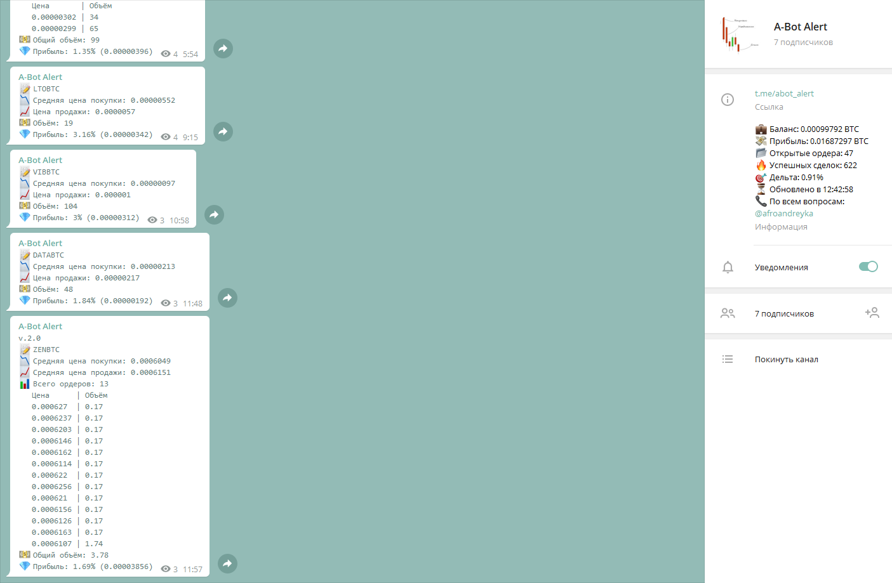
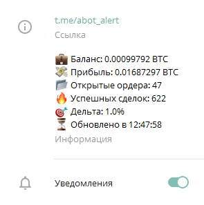
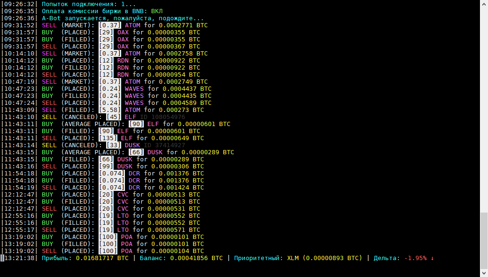

### A-Bot
##### Beta-version 0.78.1.

Бесплатный бот для алгоритмической торговли на бирже Binance.  
На данный момент поддерживается торговля только на парах к BTC.  

  

ВНИМАНИЕ! БОТ РАБОТАЕТ ТОЛЬКО НА АККАУНТАХ, ЗАРЕГИСТРИРОВАННЫХ ПО РЕФЕРАЛЬНОЙ ССЫЛКЕ РАЗРАБОТЧИКА!  
Binance: [Регистрация по реферальной ссылке](https://www.binance.com/en/register?ref=NYGPPWD2)  
Referal ID: `NYGPPWD2`

#### Параметры API настройки:  
* API-ключи — пара API ключей для обращения к Binance ([API-Management](https://www.binance.com/ru/usercenter/settings/api-management))  
* Реферальный ID — Реферальный ID Вашего аккаунта, зарегистрированного по нашему приглашению  
* Уведомления в Telegram — При включенном параметре отправляет уведомления в группу/канал в случае успешной сделки  
  * API-Token — токен, выданный BotFather ([@BotFather](https://t.me/botfather)) при создании Telegram-бота  
  * @NAME — <@ИМЯ_СООБЩЕСТВА> для отправки уведомлений. Бот, созданный на предыдущем шаге, должен состоять в группе/канале и быть её администратором с включенными возможностями публикации сообщений и изменения профиля  

  
  

#### Торговые параметры:
* `Сумма минимального ордера` [min >= 0.0001] — размер первого ордера на покупку в BTC, с которого бот начинает работать по торговой паре (например 0.0002)  
* `Минимальное суточное падение цены` [%] — На сколько процентов должна упасть цена по отношению к цене 24-мя часами ранее (например 5)  
* `Желаемая прибыль от сделки` [%] — Ожидаемая прибыль от продажи без учёта суточной дельты и трейлинг-стопа (например 4)  
* `Разница рыночной цены и цены последней покупки для усреднения` [%] — Значение, определяющее процент падения цены в текущий момент по отношению к последней покупке актива ботом (например 5)  
* `Использовать сетку усреднений` [y/n] — Если ***Y***, то при усреднении бот будет увеличивать процент падения, необходимый для нового усреднения  
  * `Шаг увеличения сетки` [%] — На сколько процентов увеличивать последующую разницу рыночной цены и цены последней покупки для усреднения (например 0.5)  
* `Максимальное количество одновременно торгуемых пар` — Допустимое количество открытых позиций (например 50)  
  * `-1` [-1] — Не ограничивать количество одновременно торгуемых ботом пар  
  * `0` [0] — Работать только с уже открытыми ордерами и не совершать новые покупки  
  * `1 и более` [1-999] — Указать количество позиций вручную  
* `Использовать общую рыночную дельту суточной цены` [y/n] — Суммировать торговые параметры с общей суточной дельтой по отобранным парам из белого списка. Данный параметр сделает стратегию более гибкой, но может уменьшить прибыль  
* `Использовать трейлинг-стоп` [y/n] — Отодвигать цену продажи в зависимости от движения цены актива. С включенным трейлингом позиция не закрывается сразу, а продаётся минимальными частями, чтобы увеличить потенциальную прибыль, либо закрывается полностью по минимальному положительному стопу. Также трейлинг-стоп служит и стоп-лоссом, гарантируя прибыльность каждой сделки. Данный параметр сделает стратегию более гибкой, но может уменьшить прибыль  
  * `Процент активации трейлинг-стопа` [%] — При каком падении от текущего хай-уровня активировать трейлинг-стоп для частичной/полной продажи. (например 0.5)  
  
  

#### Контакты:  
*[Официальная группа Telegram](https://t.me/abot_chat)*  
