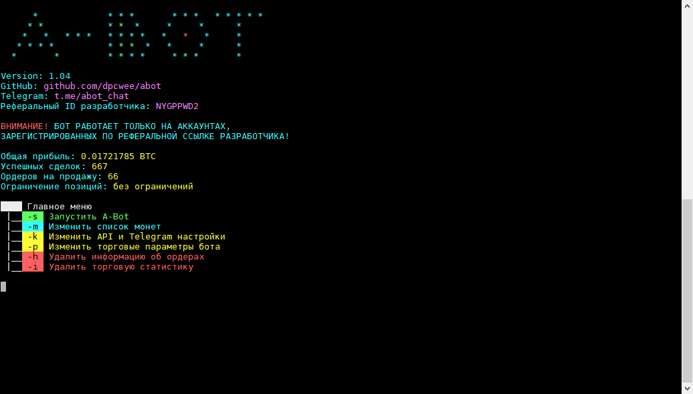
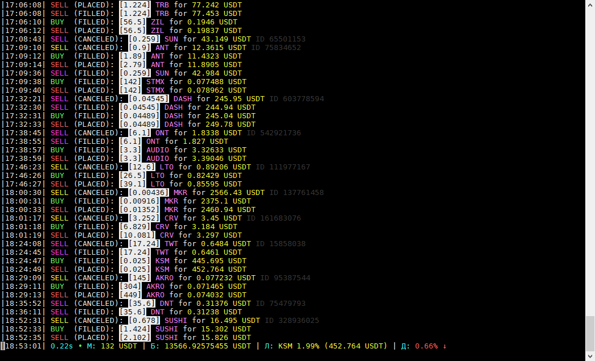
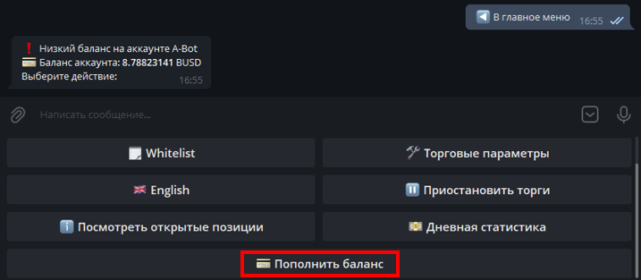
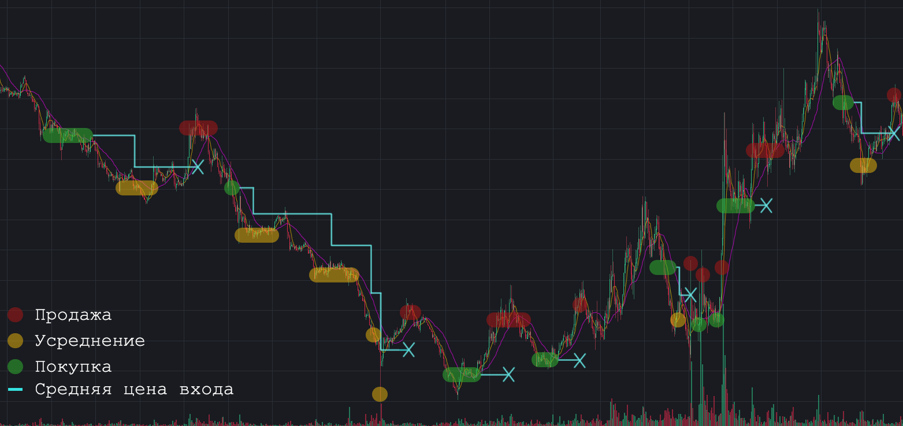
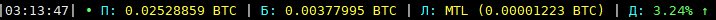
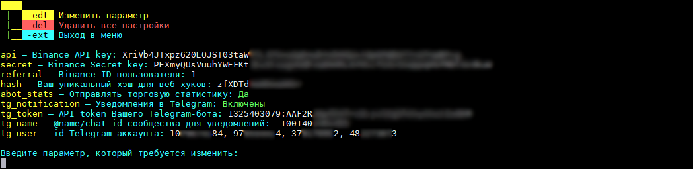
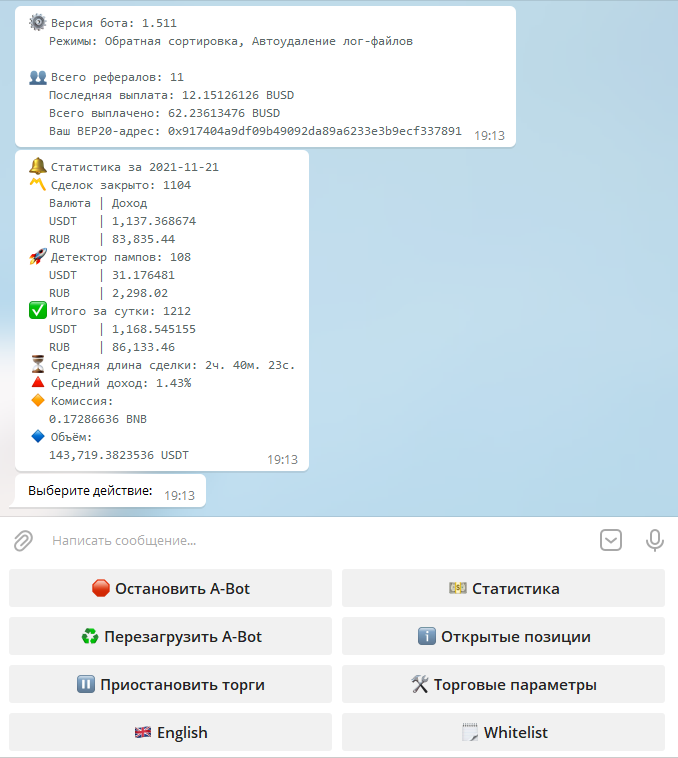
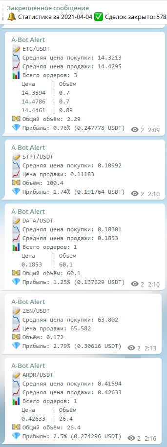
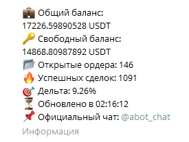

## A-Bot  
[Switch to english version](README.en.md)  
**A-Bot does not work on US accounts and IP!**  

**Никаких других официальных сайтов с репозиториями и контактами, кроме GitHub и Telegram, у проекта нет!**  

Бесплатный спотовый бот для алгоритмической мультивалютной торговли на бирже Binance, поддерживающий ручную и полностью автоматическую торговлю.    

  
  

**Бот работает бесплатно на аккаунтах Binance, зарегистрированных по реферальной ссылке разработчиков.  
Для остальных пользователей предусмотрена подписка полезного использования, о которой читайте далее.
При первом запуске бота новым пользователям, не являющимся рефералами разработчика, начисляется бонус в размере 10$.  
Binance: [Регистрация по реферальной ссылке](https://accounts.binance.com/ru/register?ref=NYGPPWD2)  
Referal ID: `NYGPPWD2`**  

### Реферальная программа
В боте существует **`реферальная система`**: человек, которого Вы привели, может указать BEP20 кошелёк от Вашего аккаунта. Текущий процент, выплачиваемый пользователям от биржевой комиссии, полученных разработчиками, составляет: `12%`

### Пополнение баланса:
  
В связи с обновлением политики торговли по API на Binance от 23.08.2021, торговля по API будет возможна ТОЛЬКО на аккаунтах, прошедших промежуточную верификацию. Для работы бота на аккаунтах, зарегистрированных **НЕ** по реферальной ссылке разработчиков, действует система полезной оплаты за совершённые ботом сделки, которая составляет 0.015% от их размера. При первом запуске бота новым пользователям автоматически начисляется бонус в размере 10$, который виден в личном Telegram-боте. В дальнейшем, в случае отсутствия денежных средств на аккаунте A-Bot, работа бота будет автоматически приостановлена, поэтому не забывайте следить за балансом. Для пополнения баланса A-Bot Вам необходимо будет настроить Telegram-бота по ***[инструкции](https://abot-config.ru/help/telegram-bot)*** и пополнить баланс на желаемую Вами сумму в BUSD, но не меньше 10$, следуя указаниям к переводу. При пополнении баланса начисляется бонус до 20% при пополнении до 400$, свыше этой суммы бонус остаётся фиксированным и составляет 20%.  

### Контакты:  
*[Официальный чат Telegram](https://t.me/abot_chat)* — для обсуждений, связи с разработчиками и развития проекта  

### Полезные ресурсы:
*[abot-config.ru](https://abot-config.ru/?utm_source=github&utm_medium=github&utm_campaign=readme) от *[@YaroslavMolchan](https://t.me/yaroslavmolchan)**  
*[stats.abot.su](https://stats.abot.su/?utm_source=github&utm_medium=github&utm_campaign=panel) от *[@DizzyUp](https://t.me/dizzyup)**

### Полезные ссылки:
*[Полное руководство по запуску бота](https://abot-config.ru/help/install?utm_source=github&utm_medium=github&utm_campaign=readme)* — подробный гайд по настройке API, Telegram, созданию сервера, а также настройке и запуску бота  
*[Screen команды для сервера](http://itautsors.ru/ispolzuem-komandu-screen-v-linux)* — работа бота в фоновом режиме на линуксе  
*[Расширенная информация на Linux](https://github.com/xoen90/gem_abot-info)* — инструмент для получения детальной информации по открытым позициям для пользователей бота на Linux by *[@xoen88](https://t.me/xoen88)*  
*[A-Bot калькулятор](https://abot-config.ru/calculator?utm_source=github&utm_medium=github&utm_campaign=readme)* — расчёт будущих усреднений, исходя из параметров buy_down, step_aver и quantity_aver  
*[Калькулятор усреднений](https://abot-config.ru/calculator-mid?utm_source=github&utm_medium=github&utm_campaign=readme)* — расчёт средней цены покупки по истории торговли   
*[Сложный процент](https://abot-config.ru/calculator-percent?utm_source=github&utm_medium=github&utm_campaign=readme)* — расчёт доходности от вложенных средств за выбранный период  
*[Стратегия 92%](https://mega.nz/file/8Y4lmK5B#TAKw4qm_eLcCLEh48zX0HjLATPI0YXEGqaKMNSQQqhc)* — стратегия сохранения депозита вплоть до 70% падения рынка от *[@freebar4ik](@freebar4ik)* & *[@volksacriph](@volksacriph)*  
*[Месячная статистика](https://mega.nz/file/MMpQFYZS#D07V4GnURzAu9oEh6ddDe-JnXym2FOpdI_2obedFhKU)* — график месячного дохода от *Wex3*  
*[Сводная эксель-таблица доходности](https://mega.nz/file/gUwQAQDT#ooSVkOJapIkx4_RN22a3O98upz3DFDftPLEkZseLHrU)* — таблица для расчёта доходности бота исходя из текущих значений прибыльности от *[@aeridiph](https://t.me/aeridiph)*  
*[Складчина](https://mega.nz/file/sARCGZ5a#NdmI2Cvebd56B4zBXQb_fsGBIqqR8sOx1bV5lw-uxiE)* — таблица расчёта долей каждого участника в складчине от *Wex3* и *[@Deltores](https://t.me/deltores)*  
*[Расчёт усреднений](https://mega.nz/file/pZBFzASD#F0GFVb4qr2uXtk95hnTKVpMsojPnrDho2-6CzOMlJL8)* — таблица расчёта цены и объёма ордеров для усреднений от *[@Deltores](https://t.me/deltores)*  
*[ASS © AntiSignalS](https://t.me/antisignals)* — канал с сигналами и полезной аналитикой от активного участника комьюнити *Bi↯llar'a*  

### Описание стратегии:
Бот работает по стратегии усреднения. Суть стратегии заключается в снижении средней цены входа в актив путём увеличения веса позиции в случае, если рыночная стоимость актива снижается по отношению к текущей стоимости ордера. Иными словами, при входе в сделку бот, исходя из пользовательских торговых настроек, размещает ордер на продажу с заданным процентом профита, но если стоимость актива падает по отношению к первой покупке, не достигнув ордера на продажу, и опускается ниже заданного значения в %, бот отменяет ордер на продажу, докупает определённое количество монет, которое всегда больше количества монет в предыдущем отменённом ордере, и размещает новую заявку на продажу по цене (`новая средняя цена покупки` + `% желаемой прибыли`). Таким образом, при падении рыночной стоимости актива бот постоянно анализирует текущие ордера и рыночные данные, сопоставляя условия настроек торговой стратегии и биржевую активность, и докупает монеты, увеличивая их общий объём и снижая новую цену продажи.

  

### Обозначения статуса ордеров:
 — Ордер на покупку исполнен  
 — Размещён ордер на продажу  
 — Ордер на продажу исполнен, позиция закрыта  
 — Ордер на продажу отменён для усреднения  
 — Ордер на продажу отменён и активирован трейлинг-стоп  
 — Частичная продажа позиции трейлингом по маркету  
 — Полная продажа позиции по трейлингу, позиция закрыта  

### Ключи запуска:  
* `-s` — Прямой запуск бота в обход главного меню  
* `-pd` — Запуск бота с разблокированным детектором пампов  
* `-ud` — Включить возможность добавления UP/DOWN токенов в список разрешённых монет  
*  `-uo` — Взять в работу ручные ордера, размещённые на продажу (не должно быть открытой ботом позиции по активу). Экспериментальная функция!

### Ключи команд:
* `-s` — Запустить бота  
* `-u` — Обновить бота до актуальной версии при её наличии
* `-o` — Посмотреть все открытые ботом позиции на бирже  
* `-m` — Удалить, добавить или сбросить параметры разрешённого для торговли списока монет  
* `-k` — Изменить настройки API ключей от Binance или параметры Telegram-уведомлений  
* `-p` — Изменить параметры торговли и работы бота  
* `-h` — Сбросить всю историю торговли по парам из разрешённого для торговли списка монет. Открытые позиции на бирже не будут отменены, но удалятся из базы данных бота  
* `-i` — Удаление торговой статистики обнулит показатели прибыли и успешных сделок, совершенных ботом  
* `-e` — Безопасный выход из бота (в главном меню) или безопасная остановка торговли и выход в главное меню (при работающем боте)  
* `-dlog` — Удалить все старые логи в папке с ботом  
* `-sat` — Продать все свободные или потерявшиеся монеты (со статусом SELL_ORDER и NO_ORDER) и конвертировать в BNB пыльные остатки  
* `--ovns` — Конфигурационный ключ, более подробно о котором можно узнать в [Telegram-канале анонсов](https://t.me/abot_announcements/61) от 16.10.2021  

### Обозначения информационной консоли:
* `s` — Время исполнения последнего цикла скрипта в секундах  
* `•` — Индикатор разницы времени бота и сервера биржи, условный пинг  
  * `Зелёный` — Стабильное соединение  
  * `Жёлтый` — Имеется незначительное отставание  
  * `Красный` — Данный цвет сигнализирует о большой задержке между временем событий на бирже и сообщениями об этих событиях в потоке веб-сокета  
* `ПД` — Детектор пампов  
  * `Зелёный` — Активирован, мониторит рынок  
  * `Жёлтый` — Активирован, но есть незначительное отставание стрима детектора пампов от текущего времени
  * `Красный` — Собирает рыночные данные, ещё не прошёл час с момента запуска бота
* `М` — Максимально допустимое количество одновременно открытых позиций
* `Б` — Свободный баланс
* `Л` — Самый близкий к продаже актив (`название монеты` `разница рыночной цены и цены ордера на продажу в %` (`цена ордера`))  
* `Д` — Суточная дельта пар из белого списка в процентах, условно обозначающая тренд рынка  

  

### Правила использования:
* Для того, чтобы бот начал работу с ручным ордером, актив должен находится в разрешённом списке монет  
* Не распоряжайтесь активами, которые находятся в работе у бота. Если видите свободный баланс — проверьте монету в терминале, возможно, бот работает по этой монете с активированным трейлингом  
* В случае расставления сеткой ручных ордеров на покупку между ордерами должен быть запас желательно в 1-2% на случай сквизов, в случае которых при резком срабатывании нескольких ордеров одновременно бот не учтёт последний из них  
* Желательный минимальный депозит для комфортной работы бота на любом рынке составляет от 1000-2000$  

### Запуск:
*Windows (>8, >Server 2012)*: Скачайте **[A-Bot.exe](https://github.com/dpcwee/abot/releases/latest)** и запустите программу  
*Linux (Ubuntu >18.04; Debian >9; CentOS >8)*: Скачайте **[A-Bot](https://github.com/dpcwee/abot/releases/latest)**  
(`wget https://github.com/dpcwee/abot/releases/download/ВЕРСИЯ/A-Bot`,  где вместо ***ВЕРСИЯ*** укажите последнюю версию),  
дайте ему права командой `chmod 755 A-Bot`, после чего запустите командой `./A-Bot`  

### Обновление:
При выходе новой версии в течение часа в главном меню A-Bot появится новая ключ-команда `-u` для обновления; также в Вашем Telegram-боте (через который Вы управляете торговым ботом и который отвечает за пуши сообщений в Ваш Telegram-канал) появится новая кнопка `Обновить A-Bot` (при обновлении через Telegram бот перезапустится и начнёт торговлю автоматически)  
**ИЛИ**  
*Windows*: Скачиваете новую версию в директорию со старым файлом (с перезаписью)  
*Linux*: В директории с ботом вводите команду на удаление старой версии `rm A-Bot`,  
затем вводите команду `wget https://github.com/dpcwee/abot/releases/download/ВЕРСИЯ/A-Bot`,  
где вместо ***ВЕРСИЯ*** указываете последнюю версию, после чего даёте права файлу `chmod 755 ./A-Bot`  
и запускаете его командой `./A-Bot`  

### Работа с screen на Linux:
1) При первом запуске/перезагрузке сервера вводим `screen -S <name_screen>` (например `screen -S abot`), попадаем сразу в новый screen и запускаем `./A-Bot`  
2) Запустили бота и можете разрывать соединение с сервером, бот будет работать в фоновом режиме в созданном скрине  
4) При повторном подключении к серверу с существующими скринами вводим `screen -x` (подключение к единственному скрину) или `screen -x <name_screen>`, если их несколько, попадая в нужный скрин. Команда `screen -S` больше не нужна!  
5) В случае перезагрузки сервера (reboot или другой апокалипсис), подключаемся к серверу и повторяем описанный цикл с 1-го пункта  

### Параметры API настройки:
* API ключи — Пара API ключей (`api` и `secret`) для обращения к Binance ([API-Management](https://www.binance.com/ru/usercenter/settings/api-management))  
* `referral` — ID Вашего аккаунта на Binance ([ID Пользователя](https://www.binance.com/ru/my/dashboard) — слева вверху в личном кабинете)  
* BEP20-кошелёк — адрес человека на Binance в сети Binance Smart Chain (BSC BEP20), который рассказал Вам о боте  
* `abot_stats` — Отправлять торговую статистику на сайт статистики *[stats.abot.su](https://stats.abot.su/?utm_source=github&utm_medium=github&utm_campaign=panel)*?
* `tg_notification` — Уведомления в Telegram о закрытых сделках, суточной статистике и текущая сводка в шапке канала  
  * `tg_token` — Токен, выданный [@BotFather](https://t.me/botfather) при создании Telegram-бота  
  * `tg_name` — <@name> или <chat_id> для отправки уведомлений. Бот, созданный на предыдущем шаге, должен состоять в группе/канале и быть её администратором с включенными возможностями публикации сообщений и изменения профиля  
  * `user_id` —  ID Telegram-аккаунта, нужный для управления торговым ботом через Telegram-бота, который можно получить у [@userinfobot](https://t.me/userinfobot), написав ему /start или нажав кнопку "Запустить".

  

### Инструкция для включения уведомлений в Telegram:
*[Настройка Telegram с пункта 1.4](https://abot-config.ru/help/windows-install)*  
**ИЛИ**  
1. Обращаемся к [BotFather'у](https://t.me/botfather) в Telegram и создаём нового бота (вводим команду /newbot или выбираем её через контекстное меню)  
2. Вводим любое имя бота  
3. Далее придумываем уникальный юзернейм для бота, который оканчивается на 'bot' (например ***exambot_abot***)  
4. При успешном создании BotFather пришлёт нам сообщение, в котором будет указана ссылка на созданного бота и его API token (например 1432166624:AAHSlGrfaFP21BXLihyGXPiUv_urjarJhty). Запишите token в приватное место  
5. Создайте публичный или частный канал (Меню -> Создать канал), придумайте его название. Далее, если канал будет публичным, придумайте ему @name (например ***test_push_abot_channel*** (@name — это название в ссылке t.me/test_push_abot_channel после слэша)), добавьте в канал созданного ранее бота ***exambot_abot*** и сделайте его администратором с возможностью изменения профиля канала и публикацией сообщений (первые две галочки возможности администратора). Если же канал будет приватным, то Вам нужно будет получить его chat_id (напишите в свой канал любое сообщение и перешлите его этому боту [@userinfobot](https://telegram.me/userinfobot). В ответ Вы получите сообщение с его chat_id. Оно будет выглядеть примерно как "-100XХХХХХХХХХ")  
6. Запустите A-Bot и в настройках параметров API и Telegram включите Telegram-уведомления, затем введите API token, который выдал Вам BotFather, @name/chat_id Вашего канала, где в администраторах находится Telegram-Bot, созданный на 5 этапе (***@test_push_abot_channel***), и user_id, который можно получить у [@userinfobot](https://t.me/userinfobot), написав ему /start или нажав кнопку "Запустить"  

Теперь каждый раз, когда бот полностью закрывает позицию на продажу, Вы будете получать уведомление в Ваш канал!  
Управлять A-Bot'ом также можно из Telegram-бота, которого вы создали у [BotFather'а](https://t.me/botfather) и добавили в свой канал для уведомлений.  

  
  
  

### Торговые параметры:
* `timeout_socket` [0.25-2] — Минимальный тайм-аут между сообщениями стрима, необходимый для медленных машин  
* `name_list` [str] — Название текущего пресета настроек (в случае команды -sve сохранится в список настроек с этим именем) (например main)  
* `min_bnb` [min >= 0.01] — Минимальный свободный баланс BNB, ниже которого бот будет докупать минимально допустимое количество BNB по рыночной цене для оплаты биржевой комиссии (например 0.03)  
* `min_balance` [min >= 0] — Не покупать/усреднять позиции, если свободный баланс составляет меньше заданного % от общего баланса (например 15)  
* `min_order` [min >= 1] — Множитель размера первого ордера на покупку. Стоимость первого ордера будет рассчитываться, как **минимальный допустимый размер ордера на бирже * min_order** (например 1.2). На USD это 10$, на BTC это 0.0001. Лимиты можно найти [здесь](https://www.binance.com/ru/trade-rule)  
* `min_price` [min >= 0.00000001 USD] — Минимальная рыночная стоимость монеты, эквивалент в USD которой равен **рыночному курсу монеты в USD**, ниже которого бот не будет открывать новые сделки по этой паре, лишь усреднять, если стоит ордер на продажу (например 0.05)  
* `min_daily_percent` [-100 < min < daily_percent < 99999] — Выше какого значения должнен подняться показатель % суточного изменения цены на бирже, чтобы бот осуществил первую покупку по паре (например -20)  
* `daily_percent` [-100 < min < 99999] — Ниже какого значения должнен упасть показатель % суточного изменения цены на бирже, чтобы бот осуществил первую покупку по паре (например -3)  
* `auto_daily_percent` [y/n] — Вместо **daily_percent** использовать общую суточную дельту разрешённого списка монет для ограничения максимального процента коридора покупок. Если ***Y***, то бот не будет покупать монеты, выросшие более, чем на `Д` % из информационной строки в консоли  
* `order_timer` [min >= 0] — Интервал паузы между закрытием сделки и новой покупкой по этой же паре в секундах  
* `min_value` [min >= 0] — Эквивалент минимального суточного торгового объёма в USD у торговой пары для открытия позиции по ней  
* `sell_up` [min > 0] — Желаемый % прибыли от продажи без учёта суточной дельты и трейлинг-стопа (например 1.65)  
* `sell_cut` [y/n] — Уменьшать желаемую прибыль на монете по мере роста количества её усреднений. Если ***Y***, то **sell_up**, применяемый для текущей монеты, будет уменьшаться с каждым новым усреднением  
* `buy_down` [min < 0] — На сколько % должна упасть рыночная цена актива по отношению к цене его последней покупки, чтобы бот усреднил позицию (например -5)  
* `max_trade_pairs` — Допустимое количество позиций на продажу, которое бот может держать одновременно открытыми (например 20). Если количество открытых ботом ордеров станет равно или больше **max_trade_pairs**, бот перестанет совершать новые покупки (кроме усреднений)  
  * `-1` [-1] — Не ограничивать количество одновременно торгуемых ботом пар  
  * `0` [0] — Работать только с уже открытыми ордерами и не совершать новые покупки  
  * `1 и более` [1-999] — Указать максимальное количество позиций вручную  
* `auto_trade_pairs` [y/n] — Разрешить боту автоматически регулировать количество разрешённых пар? Если ***Y***, бот будет автоматически корректировать максимальное количество одновременно торгуемых пар, если предыдущий параметр настроек задан пользователем вручную от 1 до 999  
* `progressive_max_pairs` [y/n] — Использовать прогрессивное уменьшение максимального количества пар. Если ***Y***, то количество пар при включенной настройке **auto_trade_pairs** будет автоматически уменьшаться не только в зависимости от соотношения свободного и общего баланса, но и от количества открытых ордеров и суммарного количества их усреднений  
* `delta_percent` [y/n] — Использовать общую рыночную дельту суточной цены? Если ***Y***, суммировать торговые параметры с общей суточной дельтой (направлением рынка) по отобранным парам из белого списка. Данный параметр сделает стратегию более гибкой, позволив удваивать прибыль максимум в 2 раза, но также может уменьшить прибыль вдвое на падающем рынке  
* `delta_deep` [y/n] — Использовать глубину падения дельты для определения падения рынка и паузы покупок/усреднений? Если ***Y***, то бот будет блокировать новые покупки и усреднения на падающем рынке до тех пор, пока не произойдёт локальный отскок всего рынка. Определение локального отскока зависит от величины падения самой дельты и выражено в пропорции 1 к 10 (при дельте -5 бот начнёт открывать позиции, когда дельта вырастет до -4.5 и выше)  
* `num_aver` [y/n] — Использовать сетку усреднений? Если ***Y***, то при усреднении бот будет увеличивать процент падения цены, необходимый для нового усреднения актива, на **buy_down** + **количество усреднений** * **step_aver**  
  * `step_aver` [%] — Шаг увеличения сетки. На сколько процентов увеличивать последующую разницу рыночной цены и цены последней покупки для усреднения (например 1.35)  
* `max_aver` [min >= 0] — Максимальное количество усреднений на одной монете (например 4)  
* `quantity_aver` [min > 0] — Множитель размера усреднения от текущего веса позиции (например 2). Иными словами, при усреднении бот будет покупать **текущее количество монет** * **quantity_aver**, тем самым новая позиция будет равна **текущее количество монет** * **quantity_aver** + **текущее количество монет**  
* `progressive_average` [y/n] — Использовать прогрессивное усреднение? Если ***Y***, бот будет самостоятельно находить объём для усреднения и делать его таким, чтобы после усреднения средняя цена входа в позицию оказалась не выше %-та average_percent от текущей рыночной цены (то есть цены нового усреднения). Иными словами, после прогрессивного усреднения ордер на продажу будет выше от текущей рыночной цены на **average_percent** + **sell_up** % (без учёта остальных динамических настроек по типу delta_percent, влияющих на sell_up)  
  * `average_percent` [100 > min >= sell_up] — Максимальный желаемый % разницы между рыночной ценой и средней ценой входа в позицию после усреднения (например 7)  
* `trailing_stop` [y/n] — Использовать трейлинг-стоп? Если ***Y***, отодвигать цену продажи в зависимости от движения цены актива. С включенным трейлингом позиция не закрывается сразу, а продаётся частями **trailing_part** на приближенных к максимальным значениям ценам, чтобы увеличить потенциальную прибыль, либо закрывается полностью при падении цены и её приближении к средней цене покупки. Данный параметр сделает стратегию более гибкой, но может уменьшить прибыль 
  * `trailing_percent` [min > 0] — При каком падении от локального хай-уровня цены активировать трейлинг-стоп для частичной/полной продажи (например 0.25)  
  * `trailing_part` [0 < min <= 100] — Размер частичной продажи по трейлингу в % от общего веса позиции (например 10)  
  * `trailing_price` [min >= 0.00000001 USD] — Активировать трейлинг-стоп только на активах стоимостью в эквиваленте к USD выше заданного процента. Это позволяет избегать минусовых сделок из-за слишком большого процента спреда монет с низкой стоимостью (например 0.2)  
* `new_listing` [y/n] — Открывать позиции по только что добавленным на биржу активам? Если ***Y***, бот будет покупать монеты сразу после их листинга и игнорировать торговые параметры по типу min_value, min_price, daily_percent и прочих, кроме min_balance и double_asset  
  * `max_buy_listing` [999 >= min>= 0] — Сколько раз бот может вновь открывать позиции по только что добавленному на биржу активу, игнорируя торговые параметры? После преодоления этого значения бот не откроет позицию по данному активу, пока условия на торговой паре не будут соответствовать торговым настройкам (например 5)  
* `user_order` [y/n] — Работа с пользовательскими ордерами после ручной покупки. Если ***Y***, то в случае покупки пользователем монеты из разрешённого списка бот автоматически поставит на продажу купленное количество монет и будет работать с этой парой так же, как и в остальных случаях, ориентируясь на торговые настройки. Также уже открытые ордера можно будет усреднять вручную: для этого во время работы бота купить нужное количество монет, после чего бот отменит ордер на продажу, рассчитает новые данные и выставит ордер по новой цене  
* `fiat_currencies` [RUB UAH ...] — Если включены уведомления в Telegram, то ежедневная статистика торгов будет рассчитываться в этих валютах вместе с **quote_asset**  
* `quote_asset` [USDT BTC ...] — Котируемые валюты для торговли (то есть те валюты, в паре к КОТОРЫМ торгуются монеты из разрешённого списка (ADA/**USDT**, ADA/**BTC**), а не которые торгуются к ним). Приоритет котируемых активов для первоочередной покупки соответствует их расположению (слева направо)  
* `double_asset` [y/n] — Если ***Y***, бот сможет покупать одну и ту же монету на нескольких котируемых активах одновременно (**ADA**/USDT и **ADA**/BTC)  
* `pump_detector` [y/n] — Использовать детектор пампов для открытия позиций? Если ***Y***, бот будет анализировать все монеты из разрешённого списка монет в реальном времени и, в случае обнаружения всплеска объёмов, доминации покупателей и роста цены актива, незамедлительно покупать монету (работает только на боте, запущенном с `-pd` ключом)  
* `pump_order` [min >= 1] — Множитель размера покупки по сигналу детектора пампов (например 2.5)  
* `pump_up` [min > 0] — Желаемый % прибыли от продажи позиции, открытой или усреднённой по сигналу детектора пампов, без учёта суточной дельты и трейлинг-стопа (например 0.35)  
* `max_pump_pairs` [min >= 0] — Допустимое количество позиций на продажу, открытых по сигналу детектора пампов, которое бот может держать одновременно открытыми (например 10)  
* `trailing_pump` [y/n] — Использовать трейлинг-стоп на ордерах, открытых по сигналу детектора пампов? Если **Y**, то бот будет активировать трейлинг на таких ордерах по параметрам `trailing_stop`'a  

  
