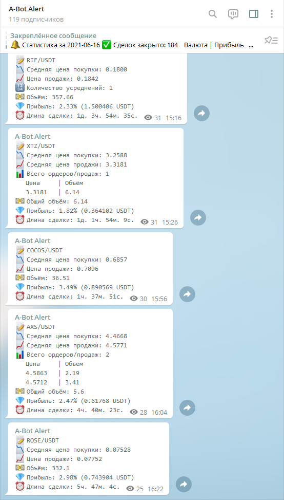

## A-Bot  
[Switch to english version](README.en.md) 

**Никаких других официальных сайтов с репозиториями и контактами, кроме GitHub и Telegram, у проекта нет!**  
**A-Bot does not work on US accounts and IP!**  

Бесплатный спотовый бот для алгоритмической мультивалютной торговли на бирже Binance, поддерживающий ручную и полностью автоматическую торговлю.    

  
  

**ВНИМАНИЕ! БОТ РАБОТАЕТ ТОЛЬКО НА АККАУНТАХ, ЗАРЕГИСТРИРОВАННЫХ ПО РЕФЕРАЛЬНОЙ ССЫЛКЕ РАЗРАБОТЧИКОВ!  
Binance: [Регистрация по реферальной ссылке](https://accounts.binance.com/ru/register?ref=NYGPPWD2)  
Referal ID: `NYGPPWD2`**  
Если у Вас возникли трудности с мультиаккаунтом, свяжитесь с **`@dpcwee`** в Telegram  
В боте существует **`реферальная система`**: человек, которого Вы привели и который зарегистрировался по нашей реферальной ссылке, может указать BEP20 кошелёк от Вашего аккаунта. При этом Ваш аккаунт также должен быть зарегистрирован по реферальной ссылке разработчиков.

### Поддержать печенькой:
`0x7680b3c00923fe29c62fb157e69187a918a076cd` — сеть BEP20 для любой крипты на Binance  

### Контакты:  
*[Официальный чат Telegram](https://t.me/abot_chat)* — для обсуждений, связи с разработчиками и развития проекта  

### Полезные ресурсы:
*[abot-config.ru](https://abot-config.ru/?utm_source=github&utm_medium=github&utm_campaign=readme) от *[@YaroslavMolchan](https://t.me/yaroslavmolchan)**  
*[stats.abot.su](https://stats.abot.su/?utm_source=github&utm_medium=github&utm_campaign=panel) от *[@DizzyUp](https://t.me/dizzyup)**

### Полезные ссылки:
*[Полное руководство по запуску бота](https://abot-config.ru/help/install?utm_source=github&utm_medium=github&utm_campaign=readme)* — подробный гайд по настройке API, Telegram, созданию сервера, а также настройке и запуску бота  
*[Google Cloud](https://dpcwee.medium.com/%D0%BF%D0%BE%D0%BB%D1%83%D1%87%D0%B0%D0%B5%D0%BC-%D0%B1%D0%B5%D1%81%D0%BF%D0%BB%D0%B0%D1%82%D0%BD%D1%8B%D0%B5-6-%D0%BC%D0%B5%D1%81%D1%8F%D1%86%D0%B5%D0%B2-google-cloud-1da76f2f62fd)* — гайд на получение бесплатного сервера для бота  
*[Screen команды для сервера](http://itautsors.ru/ispolzuem-komandu-screen-v-linux)* — работа бота в фоновом режиме на линуксе  
*[A-Bot калькулятор](https://abot-config.ru/calculator?utm_source=github&utm_medium=github&utm_campaign=readme)* — расчёт будущих усреднений, исходя из параметров buy_down, step_aver и quantity_aver  
*[Калькулятор усреднений](https://abot-config.ru/calculator-mid?utm_source=github&utm_medium=github&utm_campaign=readme)* — расчёт средней цены покупки по истории торговли   
*[Сложный процент](https://abot-config.ru/calculator-percent?utm_source=github&utm_medium=github&utm_campaign=readme)* — расчёт доходности от вложенных средств за выбранный период  
*[Месячная статистика](https://mega.nz/file/MMpQFYZS#D07V4GnURzAu9oEh6ddDe-JnXym2FOpdI_2obedFhKU)* — График месячного дохода от *Wex3*  
*[Сводная эксель-таблица доходности](https://mega.nz/file/gUwQAQDT#ooSVkOJapIkx4_RN22a3O98upz3DFDftPLEkZseLHrU)* — таблица для расчёта доходности бота исходя из текущих значений прибыльности от *[@aeridiph](https://t.me/aeridiph)*  
*[Складчина Beta](https://mega.nz/file/NABhlASZ#ZGSt1kBEwM1aEScdZAawYrujQO4Rrcamu0aTkngM2rA)* — Таблица расчёта долей каждого участника в складчине от *Wex3* и *[@Deltores](https://t.me/deltores)*  
*[Расчёт усреднений](https://mega.nz/file/pZBFzASD#F0GFVb4qr2uXtk95hnTKVpMsojPnrDho2-6CzOMlJL8)* — Таблица расчёта цены и объёма ордеров для усреднений от *[@Deltores](https://t.me/deltores)*  
*[ASS © AntiSignalS](https://t.me/antisignals)* — канал с сигналами от активного участника комьюнити *Bi↯llar'a*  

### Форумы:
*[Cryptotalk](https://cryptotalk.org/topic/332721-%D0%B1%D0%B5%D1%81%D0%BF%D0%BB%D0%B0%D1%82%D0%BD%D1%8B%D0%B9-%D1%82%D0%BE%D1%80%D0%B3%D0%BE%D0%B2%D1%8B%D0%B9-%D0%B1%D0%BE%D1%82-%D0%B4%D0%BB%D1%8F-binance/)* *[Bits.Media](https://forum.bits.media/index.php?/topic/178120-a-bot-%D0%B1%D0%B5%D1%81%D0%BF%D0%BB%D0%B0%D1%82%D0%BD%D1%8B%D0%B9-%D0%B1%D0%BE%D1%82-%D0%B4%D0%BB%D1%8F-binance/)* *[Bitcointalk](https://bitcointalk.org/index.php?topic=5301070)* *[Mining-Hub](https://mininghub.cc/threads/474/)*

### Описание стратегии:
Бот работает по стратегии усреднения. Суть стратегии заключается в снижении средней цены входа в актив путём увеличения веса позиции в случае, если рыночная стоимость актива снижается по отношению к текущей стоимости ордера. Иными словами, при входе в сделку бот, исходя из пользовательских торговых настроек, размещает ордер на продажу с заданным процентом профита, но если стоимость актива падает по отношению к первой покупке, не достигнув ордера на продажу, и опускается ниже заданного значения в %, бот отменяет ордер на продажу, докупает определённое количество монет, которое всегда больше количества монет в предыдущем отменённом ордере, и размещает новую заявку на продажу по цене (`новая средняя цена покупки` + `% желаемой прибыли`). Таким образом, при падении рыночной стоимости актива бот постоянно анализирует текущие ордера и рыночные данные, сопоставляя условия настроек торговой стратегии и биржевую активность, и докупает монеты, увеличивая их общий объём и снижая новую цену продажи.

  

### Обозначения статуса ордеров:
 — Ордер на покупку исполнен  
 — Размещён ордер на продажу  
 — Ордер на продажу исполнен, позиция закрыта  
 — Ордер на продажу отменён для усреднения  
 — Ордер на продажу отменён и активирован трейлинг-стоп  
 — Частичная продажа позиции трейлингом по маркету  
 — Полная продажа позиции по трейлингу, позиция закрыта  

### Ключи команд:
* `-u` — Обновить бота до актуальной версии  
* `-s` — Запустить бота  
* `-o` — Посмотреть все открытые ботом позиции на бирже  
* `-m` — Удалить, добавить или сбросить параметры разрешённого для торговли списока монет  
* `-k` — Изменить настройки API ключей от Binance или параметры Telegram-уведомлений  
* `-p` — Изменить параметры торговли и работы бота  
* `-h` — Сбросить всю историю торговли по парам из разрешённого для торговли списка монет. Открытые позиции на бирже не будут отменены, но удалятся из базы данных бота  
* `-i` — Удаление торговой статистики обнулит показатели прибыли и успешных сделок, совершенных ботом  
* `-e` — Безопасный выход из бота (в главном меню)/безопасная остановка торговли и выход в главное меню (при работающем боте)  
* `-dlog` — Удалить все старые логи в папке с ботом

### Обозначения информационной консоли:
* `s` — Время исполнения последнего цикла скрипта в секундах  
* `•` — Индикатор разницы времени бота и сервера биржи, условный пинг  
  * `Зелёный` — Стабильное соединение  
  * `Жёлтый` — Имеется незначительное отставание  
  * `Красный` — Данный цвет сигнализирует о большой задержке между временем событий на бирже и сообщениями об этих событиях в потоке веб-сокета  
* `М` — Максимальное количество одновременно открытых позиций, автоматически регулирующееся ботом при соответствующей включенной настройке
* `Б` — Свободный баланс
* `Л` — Самый близкий к продаже актив (`название монеты` `разница рыночной цены и цены ордера на продажу в %` (`цена ордера`))  
* `Д` — Суточная дельта пар из белого списка в процентах, условно обозначающая тренд рынка  

  

### Правила использования:
* Для того, чтобы бот начал работу с ручным ордером, актив должен находится в разрешённом списке монет  
* Не распоряжайтесь активами, которые находятся в работе у бота. Если видите свободный баланс — проверьте монету в терминале, возможно, бот работает по этой монете с активированным трейлингом  
* Желательный минимальный депозит для комфортной работы бота на любом рынке составляет от 1000-2000$  

### Запуск:
*Windows (только 10-я 64-битная)*: Скачайте **[A-Bot.exe](https://github.com/dpcwee/abot/releases/latest)** и запустите программу  
*Linux (минимум 18.04)*: Скачайте **[A-Bot](https://github.com/dpcwee/abot/releases/latest)**  
(`wget https://github.com/dpcwee/abot/releases/download/ВЕРСИЯ/A-Bot`,  где вместо ***ВЕРСИЯ*** укажите последнюю версию),  
дайте ему права командой `chmod 755 A-Bot`, после чего запустите командой `./A-Bot`  

### Обновление:
*Windows*: Скачиваете новую версию в директорию со старым файлом (с перезаписью)  
*Linux*: В директории с ботом вводите команду на удаление старой версии `rm A-Bot`,  
затем вводите команду `wget https://github.com/dpcwee/abot/releases/download/ВЕРСИЯ/A-Bot`,  
где вместо ***ВЕРСИЯ*** указываете последнюю версию, после чего даёте права файлу `chmod 755 ./A-Bot`  
и запускаете его командой `./A-Bot`

### Работа с screen на Linux:
1) При первом запуске/перезагрузке сервера вводим `screen -S <name_screen>` (например `screen -S abot`), попадаем сразу в новый screen и запускаем `./A-Bot`  
2) Запустили бота и можете разрывать соединение с сервером, бот будет работать в фоновом режиме в созданном скрине  
4) При повторном подключении к серверу с существующими скринами вводим `screen -x` (подключение к единственному скрину) или `screen -x <name_screen>`, если их несколько, попадая в нужный скрин. Команда `screen -S` больше не нужна!  
5) В случае перезагрузки сервера (reboot или другой апокалипсис), подключаемся к серверу и повторяем описанный цикл с 1-го пункта  

### Параметры API настройки:
* API ключи — пара API ключей (api и secret) для обращения к Binance ([API-Management](https://www.binance.com/ru/usercenter/settings/api-management))  
* referral — ID Вашего аккаунта на Binance, зарегистрированного по нашему приглашению ([Referal ID](https://www.binance.com/ru/my/dashboard) — слева вверху в личном кабинете)  
* BEP20-кошелёк — адрес человека на Binance в сети Binance Smart Chain (BSC), который рассказал Вам о боте  
* tg_notification — Уведомления в Telegram о закрытых сделках, суточной статистике и текущая сводка в шапке канала  
  * tg_token — токен, выданный [@BotFather](https://t.me/botfather) при создании Telegram-бота  
  * tg_name — <@name> или <chat_id> для отправки уведомлений. Бот, созданный на предыдущем шаге, должен состоять в группе/канале и быть её администратором с включенными возможностями публикации сообщений и изменения профиля  
  * user_id —  id Telegram аккаунта, нужный для управления торговым ботом через Telegram-бота, который можно получить у [@userinfobot](https://t.me/userinfobot), написав ему /start или нажав кнопку "Запустить".

  

### Инструкция для включения уведомлений в Telegram:
*[Настройка Telegram с пункта 1.4](https://abot-config.ru/help/windows-install)*  
**ИЛИ**  
1. Обращаемся к [BotFather'у](https://t.me/botfather) в Telegram и создаём нового бота (вводим команду /newbot или выбираем её через контекстное меню)  
2. Вводим любое имя бота  
3. Далее придумываем уникальный юзернейм для бота, который оканчивается на 'bot' (например ***exambot_abot***)  
4. При успешном создании BotFather пришлёт нам сообщение, в котором будет указана ссылка на созданного бота и его API token (например 1432166624:AAHSlGrfaFP21BXLihyGXPiUv_urjarJhty). Запишите token в приватное место  
5. Создайте публичный или частный канал (Меню -> Создать канал), придумайте его название. Далее, если канал будет публичным, придумайте ему @name (например ***test_push_abot_channel*** (@name — это название в ссылке t.me/test_push_abot_channel после слэша)), добавьте в канал созданного ранее бота ***exambot_abot*** и сделайте его администратором с возможностью изменения профиля канала и публикацией сообщений (первые две галочки возможности администратора). Если же канал будет приватным, то Вам нужно будет получить его chat_id (напишите в свой канал любое сообщение и перешлите его этому боту [@userinfobot](https://telegram.me/userinfobot). В ответ Вы получите сообщение с его chat_id. Оно будет выглядеть примерно как "-100XХХХХХХХХХ")  
6. Запустите A-Bot и в настройках параметров API и Telegram включите Telegram-уведомления, затем введите API token, который выдал Вам BotFather, @name/chat_id Вашего канала, где в администраторах находится Telegram-Bot, созданный на 5 этапе (***@test_push_abot_channel***), и user_id, который можно получить у [@userinfobot](https://t.me/userinfobot), написав ему /start или нажав кнопку "Запустить"  
Теперь каждый раз, когда бот полностью закрывает позицию на продажу, Вы будете получать уведомление в Ваш канал!

  
  

### Торговые параметры:
* `clean_socket` [y/n] — Очищать стек данных веб-сокета в случае частого появления красного индикатора или медленной скорости работы бота из-за большого количества активов в quote_asset. Оставлять ***N***, если проблем не наблюдается  
* `timeout_socket` [0-2] — Минимальный тайм-аут между сообщениями стрима, необходимый для медленных машин или плохого соединения, приводивших к зависанию ордеров или появлению свободного баланса. Оставлять ***0***, если проблем не наблюдается
* `name_list` [str] — Название текущего пресета настроек (в случае команды -sve сохранится в список настроек с этим именем) (например main)  
* `min_bnb` [min >= 0.01] — Минимальный свободный баланс BNB, ниже которого бот будет докупать минимально допустимое количество BNB по рыночной цене для оплаты биржевой комиссии (например 0.03)  
* `min_balance` [min >= 0] — Не покупать/усреднять позиции, если свободный баланс составляет меньше заданного % от общего баланса (например 15)  
* `min_order` [min >= 1] — Множитель размера первого ордера на покупку. Стоимость первого ордера будет рассчитываться, как **минимальный допустимый размер ордера на бирже * min_order** (например 1.2). На USDT это 10$, на BTC это 0.0001. Лимиты можно найти [здесь](https://www.binance.com/ru/trade-rule)  
* `min_price` [min >= 0.00000001 USDT] — Минимальная рыночная стоимость монеты, эквивалент в USDT которой равен **рыночному курсу монеты в USD**, ниже которого бот не будет открывать новые сделки по этой паре, лишь усреднять, если стоит ордер на продажу (например 0.05)  
* `min_daily_percent` [-100 < min < daily_percent < 99999] — Выше какого значения должнен подняться показатель % суточного изменения цены на бирже, чтобы бот осуществил первую покупку по паре (например -20)  
* `daily_percent` [-100 < min < 99999] — Ниже какого значения должнен упасть показатель % суточного изменения цены на бирже, чтобы бот осуществил первую покупку по паре (например -3)  
* `sell_up` [min > 0.15] — Желаемый % прибыли от продажи без учёта суточной дельты и трейлинг-стопа (например 1.65)  
* `sell_cut` [y/n] — Уменьшать желаемую прибыль на монете по мере роста количества её усреднений. Если ***Y***, то **sell_up**, применяемый для текущей монеты, будет уменьшаться с каждым новым усреднением  
* `buy_down` [min < 0] — На сколько % должна упасть рыночная цена актива по отношению к цене его последней покупки, чтобы бот усреднил позицию (например -5)  
* `max_trade_pairs` — Допустимое количество позиций на продажу, которое бот может держать одновременно открытыми (например 20). Если количество открытых ботом ордеров станет равно или больше **max_trade_pairs**, бот перестанет совершать новые покупки (кроме усреднений)  
  * `-1` [-1] — Не ограничивать количество одновременно торгуемых ботом пар  
  * `0` [0] — Работать только с уже открытыми ордерами и не совершать новые покупки  
  * `1 и более` [1-999] — Указать максимальное количество позиций вручную  
* `auto_trade_pairs` [y/n] — Разрешить боту автоматически регулировать количество разрешённых пар? Если ***Y***, бот будет автоматически корректировать максимальное количество одновременно торгуемых пар, если предыдущий параметр настроек задан пользователем вручную от 1 до 999  
* `progressive_max_pairs` [y/n] — Использовать прогрессивное уменьшение максимального количества пар. Если ***Y***, то количество пар при включенной настройке **auto_trade_pairs** будет автоматически уменьшаться не только в зависимости от соотношения свободного и общего баланса, но и от количества открытых ордеров и суммарного количества их усреднений  
* `delta_percent` [y/n] — Использовать общую рыночную дельту суточной цены? Если ***Y***, суммировать торговые параметры с общей суточной дельтой (направлением рынка) по отобранным парам из белого списка. Данный параметр сделает стратегию более гибкой, но может уменьшить прибыль  
* `delta_deep` [y/n] — Использовать глубину падения дельты для определения падения рынка и паузы покупок/усреднений? Если ***Y***, то бот будет блокировать новые покупки и усреднения на падающем рынке до тех пор, пока не произойдёт локальный отскок всего рынка. Определение локального отскока зависит от величины падения самой дельты и выражено в пропорции 1 к 10 (при дельте -5 бот начнёт открывать позиции, когда дельта вырастет до -4.5 и выше)  
* `num_aver` [y/n] — Использовать сетку усреднений? Если ***Y***, то при усреднении бот будет увеличивать процент падения цены, необходимый для нового усреднения актива, на **buy_down** + (**количество усреднений**) * **step_aver**  
  * `step_aver` [%] — Шаг увеличения сетки. На сколько процентов увеличивать последующую разницу рыночной цены и цены последней покупки для усреднения (например 1.35)  
* `max_aver` [min >= 0] — Максимальное количество усреднений на одной монете (например 4)  
* `quantity_aver` [min >= 1] — Множитель размера усреднения от текущего веса позиции (например 2). Иными словами, при усреднении бот будет покупать **текущее количество монет** * **quantity_aver**, тем самым новая позиция будет равна **текущее количество монет** * **quantity_aver** + **текущее количество монет**. Не рекомендуется делать этот параметр ниже 2  
* `trailing_stop` [y/n] — Использовать трейлинг-стоп? Если ***Y***, отодвигать цену продажи в зависимости от движения цены актива. С включенным трейлингом позиция не закрывается сразу, а продаётся частями **trailing_part** на приближенных к максимальным значениям ценам, чтобы увеличить потенциальную прибыль, либо закрывается полностью при падении цены и её приближении к средней цене покупки. Данный параметр сделает стратегию более гибкой, но может уменьшить прибыль 
  * `trailing_percent` [min > 0] — При каком падении от локального хай-уровня цены активировать трейлинг-стоп для частичной/полной продажи (например 0.25)  
  * `trailing_part` [100 >= min >= 0] — Размер частичной продажи по трейлингу в % от общего веса позиции (например 10)  
  * `trailing_price` [min >= 0.00000001 USDT] — Активировать трейлинг-стоп только на активах стоимостью в эквиваленте к USD выше заданного процента. Это позволяет избегать минусовых сделок из-за слишком большого процента спреда монет с низкой стоимостью (например 0.2)  
* `user_order` [y/n] — Работа с пользовательскими ордерами после ручной покупки. Если ***Y***, то в случае покупки пользователем монеты из разрешённого списка бот автоматически поставит на продажу купленное количество монет и будет работать с этой парой так же, как и в остальных случаях, ориентируясь на торговые настройки. Также уже открытые ордера можно будет усреднять вручную: для этого во время работы бота купить нужное количество монет, после чего бот отменит ордер на продажу, рассчитает новые данные и выставит ордер по новой цене  
* `fiat_currencies` [RUB UAH ...] — Если включены уведомления в Telegram, то ежедневная статистика торгов будет рассчитываться в этих валютах вместе с **quote_asset**  
* `quote_asset` [USDT BTC ...] — Котируемые валюты для торговли (то есть те валюты, в паре к КОТОРЫМ торгуются монеты из разрешённого списка (ADA/**USDT**, ADA/**BTC**), а не которые торгуются к ним)      
* `double_asset` [y/n] — Если ***Y***, бот сможет покупать одну и ту же монету на нескольких котируемых активах одновременно (**ADA**/USDT и **ADA**/BTC)  

  
