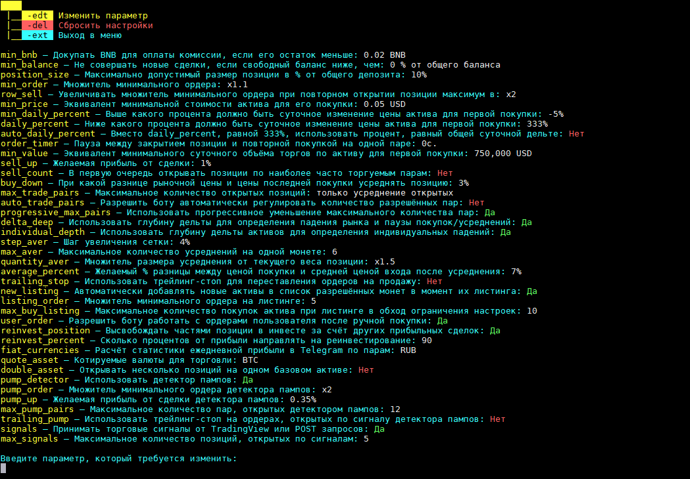

## A-Bot

Бесплатный спотовый бот для алгоритмической торговли на бирже Binance.  
На данный момент поддерживается торговля только на парах к BTC.  

  
  

**ВНИМАНИЕ! БОТ РАБОТАЕТ ТОЛЬКО НА АККАУНТАХ, ЗАРЕГИСТРИРОВАННЫХ ПО РЕФЕРАЛЬНОЙ ССЫЛКЕ РАЗРАБОТЧИКА!  
Binance: [Регистрация по реферальной ссылке](https://www.binance.com/en/register?ref=NYGPPWD2)  
Referal ID: `NYGPPWD2`**  
Если у Вас возникли трудности с мультиаккаунтом, свяжитесь с **@dpcwee** в Telegram

### Описание стратегии:
Бот работает по стратегии усреднения. Суть стратегии заключается в снижении средней цены входа в актив путём увеличения веса позиции в случае, если рыночная стоимость актива снижается по отношению к текущей стоимости ордера. Иными словами, при входе в сделку бот, исходя из пользовательских торговых настроек, размещает ордер на продажу с заданным процентом профита, но если стоимость актива падает по отношению к первой покупке, не достигнув ордера на продажу, и опускается ниже заданного значения в %, бот отменяет ордер на продажу, докупает определённое количество монет, которое всегда больше количества монет в предыдущем отменённом ордере, и размещает новую заявку на продажу по цене (`новая средняя цена покупки` + `% желаемой прибыли`). Таким образом, при падении рыночной стоимости актива бот постоянно анализирует текущие ордера и рыночные данные, сопоставляя условия настроек торговой стратегии и биржевую активность, и докупает монеты, увеличивая их общий объём и снижая новую цену продажи.

  

### Контакты:  
*[Официальный чат Telegram](https://t.me/abot_chat)* — для обсуждений, связи с разработчиками и развития проекта  

### Форумы:
*[Cryptotalk](https://cryptotalk.org/topic/332721-%D0%B1%D0%B5%D1%81%D0%BF%D0%BB%D0%B0%D1%82%D0%BD%D1%8B%D0%B9-%D1%82%D0%BE%D1%80%D0%B3%D0%BE%D0%B2%D1%8B%D0%B9-%D0%B1%D0%BE%D1%82-%D0%B4%D0%BB%D1%8F-binance/)*  
*[Bits.Media](https://forum.bits.media/index.php?/topic/178120-a-bot-%D0%B1%D0%B5%D1%81%D0%BF%D0%BB%D0%B0%D1%82%D0%BD%D1%8B%D0%B9-%D0%B1%D0%BE%D1%82-%D0%B4%D0%BB%D1%8F-binance/)*  
*[MiningHub](https://mininghub.cc/threads/474/)*  
*[Bitcointalk](https://bitcointalk.org/index.php?topic=5301070)*  

### Полезные ссылки:
*[Google Cloud](https://dpcwee.medium.com/%D0%BF%D0%BE%D0%BB%D1%83%D1%87%D0%B0%D0%B5%D0%BC-%D0%B1%D0%B5%D1%81%D0%BF%D0%BB%D0%B0%D1%82%D0%BD%D1%8B%D0%B5-6-%D0%BC%D0%B5%D1%81%D1%8F%D1%86%D0%B5%D0%B2-google-cloud-1da76f2f62fd)* - гайд на получение бесплатного сервера для бота  

### Обозначения статуса ордеров:
 — Размещён ордер на покупку  
 — Ордер на покупку исполнен  
 — Размещён ордер на продажу  
 — Ордер на продажу исполнен, позиция закрыта  
 — Ордер на продажу отменён для усреднения  
 — Ордер на продажу отменён и активирован трейлинг-стоп  
 — Частичная продажа позиции трейлингом по маркету  
 — Полная продажа позиции по трейлингу, позиция закрыта  

### Ключи команд:
* `-s` — Запуск бота  
* `-o` — Посмотреть все открытые ботом позиции на бирже  
* `-m` — Удалить, добавить или сбросить параметры разрешённого для торговли списока монет  
* `-k` — Изменить настройки API ключей от Binance или параметры Telegram-уведомлений  
* `-p` — Изменить параметры торговли и работы бота  
* `-h` — Сбросить всю историю торговли по парам из разрешённого для торговли списка монет. Открытые позиции на бирже не будут отменены, но удалятся из базы данных бота  
* `-i` — Удаление торговой статистики обнулит показатели прибыли и успешных сделок, совершенных ботом  

### Обозначения информационной консоли:
* `•` — Индикатор разницы времени бота и сервера биржи, условный пинг  
  * `Зелёный` — Стабильное соединение  
  * `Жёлтый` — Имеется незначительное отставание  
  * `Красный` — Данный цвет сигнализирует о большой задержке между временем событий на бирже и сообщениями об этих событиях в потоке веб-сокета  
* `М` — Максимальное количество одновременно открытых позиций, автоматически регулирующееся ботом при соответствующей включенной настройке
* `П` — Общая прибыль от торговли бота в BTC  
* `Б` — Свободный баланс в BTC  
* `Л` — Самый близкий к продаже актив (`название монеты` `разница рыночной цены и цены ордера на продажу в %` (`цена ордера`))  
* `Д` — Суточная дельта пар из белого списка в процентах, условно обозначающая тренд рынка  

  

### Правила использования:
* Для того, чтобы бот начал работу с ручным ордером, актив должен находится в разрешённом списке монет и на нём не должно быть уже открытых ордеров  
* Не дублируйте ручные ордера для подхватывания ботом. Если хотите войти в сделку — разместите один ордер на покупку. Если Вы хотите переставить этот ордер — сначала отмените его и только после этого создайте новую заявку на покупку  
* Не распоряжайтесь активами, которые находятся в работе у бота. Если видите свободный баланс — проверьте монету в терминале, возможно, бот работает по этой монете с активированным трейлингом  

### Запуск:
*Windows (только 10-я 64-битная)*: Скачиваете **[A-Bot.exe](https://github.com/dpcwee/abot/releases/latest)** и запускаете программу  
*Linux (минимум 18.04)*: Скачиваете **[A-Bot](https://github.com/dpcwee/abot/releases/latest)**,  
заходите в директорию с файлом и прописываете ему права командой `chmod 755 A-Bot`,  
после чего запускаете командой `/A-Bot`

### Обновление:
*Windows*: Скачиваете новую версию в директорию старого файла (с перезаписью), где находятся файлы бота  
*Linux*: В директории с ботом вводите команду на удаление старой версии `rm A-Bot`,  
затем вводите команду `wget https://github.com/dpcwee/abot/releases/download/{VERSION}/A-Bot`,  
где вместо ***{VERSION}*** указываете последнюю версию, после чего даёте права файлу `chmod 755 ./A-Bot`  
и запускаете его командой `./A-Bot`

### Рекомендации:
Для того, чтобы бот работал корректно, пользователю не рекомендуется вмешиваться в торговлю по парам из его белого списка. Бот использует уникальный клиентский ID и на него не влияют ордера пользователя, совершенные посредством веб-сайта Binance или сторонних программ, имеющих доступ к торговому аккаунту, но при этом пользователь может ошибочно распорядиться активами, задействованными в работе бота, и, т.к. торговые данные по работе программы храняться в локальной базе данных, новый запрос бота к Binance может не сработать, если фактические данные баланса активов отличаются от тех, которые храняться локально ботом, что повлечёт за собой сброс истории по торговой паре и обнуление статистики по ней.  

В идеале, бота рекомендуется подключить к второстепенному аккаунту, на котором пользователь не будет производить торговых действий на спотовом рынке. Это гарантирует изолированность программы и её стабильную работу.  

Бот оплачивает комиссию биржи в BNB, эту опцию он включает автоматически при каждом запуске. Также он постоянно проверяет баланс BNB и докупает токен за BTC в случае, если его количество меньше 0.1, поэтому пользователю необходимо держать баланс в BTC для дозакупки Binance Coin, иначе бот просто не будет совершать новые сделки до тех пор, пока условие не будет истинным.

Также, при переносе бота в другую директорию, не забудьте перенести файл abot.db вместе с ним.

### Параметры API настройки:
* API ключи — пара API ключей для обращения к Binance ([API-Management](https://www.binance.com/ru/usercenter/settings/api-management))  
* ID пользователя — ID Вашего аккаунта, зарегистрированного по нашему приглашению ([Referal ID](https://www.binance.com/ru/my/dashboard) — слева вверху в личном кабинете)  
* Уведомления в Telegram — при включенном параметре отправляет уведомления в группу/канал в случае закрытия позиции  
  * API-Token — токен, выданный BotFather ([@BotFather](https://t.me/botfather)) при создании Telegram-бота  
  * @name — <@name> или <chat_id> для отправки уведомлений. Бот, созданный на предыдущем шаге, должен состоять в группе/канале и быть её администратором с включенными возможностями публикации сообщений и изменения профиля  

  

### Инструкция для включения уведомлений в Telegram:
1. Обращаемся к [BotFather'у](https://t.me/botfather) в Telegram и создаём нового бота (вводим команду /newbot или выбираем её через контекстное меню)  
2. Вводим любое имя бота (например test_push_abot)  
3. Далее придумываем уникальный юзернейм для бота, который оканчивается на 'bot' (например exambot_abot)  
4. При успешном создании BotFather пришлёт нам сообщение, в котором будет указана ссылка на созданного бота и его API token (например 1432166624:AAHSlGrfaFP21BXLihyGXPiUv_urjarJhty). Запишите token в приватное место  
5. Создайте публичный или частный канал (Меню -> Создать канал), придумайте его название. Далее, если канал будет публичным, придумайте ему @name (например ***@test_push_abot_channel***). Если же канал будет приватным, то Вам нужно будет получить его chat_id (отправьте в своём приватном канале любое сообщение и перейдите в браузере по ссылке `https://api.telegram.org/bot{YOUR_API_KEY}/getUpdates`, где вместо ***{YOUR_API_KEY}*** введите Telegram token, выданный BotFather'ом. Затем среди массива данных найдите ключ "chat" и его значение "id". Оно будет выглядеть примерно как "-1XXXХХХХХХХХХ")  
6. После того, как Вы создали канал, добавьте туда созданного ранее бота ***@test_push_abot_channel*** и сделайте его администратором с возможностью изменения профиля канала и публикацией сообщений (первые две галочки возможности администратора)  
7. Запустите A-Bot и в настройках параметров API и Telegram включите Telegram-уведомления, затем введите API token, который выдал Вам BotFather и @name/chat_id Вашего канала, где в администраторах находится Telegram-Bot, созданный на 5 этапе (***@test_push_abot_channel***)  
Теперь каждый раз, когда бот полностью закрывает позицию на продажу, Вы будете получать уведомление в Ваш канал!

  
  

### Торговые параметры:
* `Сумма минимального ордера` [min >= 0.0001 BTC] — размер первого ордера на покупку в BTC, с которого бот начинает работать по торговой паре (например 0.0001)  
* `Минимальная стоимость актива для входа в позицию` [min >= 0.00000001 BTC] — Минимальная рыночная стоимость монеты, ниже которой бот не будет открывать новые сделки по этой паре, лишь усреднять, если стоит ордер на продажу (например 0.0000005)  
* `Минимальное суточное падение цены` [%] — На сколько процентов должна упасть цена актива по отношению к цене 24-мя часами ранее, чтобы бот совершил первую покупку по данному активу (например 5)  
* `Желаемая прибыль от сделки` [%] — Ожидаемая прибыль от продажи без учёта суточной дельты и трейлинг-стопа (например 3.75)  
* `Разница рыночной цены и цены последней покупки для усреднения` [%] — Значение, определяющее процент падения цены в текущий момент по отношению к последней цене покупки актива ботом (например 5)   
* `Максимальное количество одновременно торгуемых пар` — Допустимое количество открытых позиций, которое бот может держать одновременно открытыми (например 20)  
  * `-1` [-1] — Не ограничивать количество одновременно торгуемых ботом пар  
  * `0` [0] — Работать только с уже открытыми ордерами и не совершать новые покупки  
  * `1 и более` [1-999] — Указать максимальное количество позиций вручную  
* `Разрешить боту автоматически регулировать количество разрешённых пар` [y/n] — Если ***Y***, бот будет автоматически корректировать максимальное количество одновременно торгуемых пар, если предыдущий параметр настроек задан пользователем вручную от 1 до 999  
* `Использовать общую рыночную дельту суточной цены` [y/n] — Если ***Y***, суммировать торговые параметры с общей суточной дельтой по отобранным парам из белого списка. Данный параметр сделает стратегию более гибкой, но может уменьшить прибыль  
* `Использовать сетку усреднений` [y/n] — Если ***Y***, то при усреднении бот будет увеличивать процент падения цены, необходимый для нового усреднения актива  
  * `Шаг увеличения сетки` [%] — На сколько процентов увеличивать последующую разницу рыночной цены и цены последней покупки для усреднения (например 0.75) 
* `Использовать трейлинг-стоп` [y/n] — Если ***Y***, отодвигать цену продажи в зависимости от движения цены актива. С включенным трейлингом позиция не закрывается сразу, а продаётся минимальными частями на приближенных к максимальным значениям ценам, чтобы увеличить потенциальную прибыль, либо закрывается полностью по минимальному положительному стопу. Также трейлинг-стоп служит и стоп-лоссом, гарантируя прибыльность каждой сделки. Данный параметр сделает стратегию более гибкой, но может уменьшить прибыль  
  * `Процент активации трейлинг-стопа` [%] — При каком падении от локального хай-уровня цены активировать трейлинг-стоп для частичной/полной продажи (например 0.8)  
  * `Активация трейлинг-стопа на активах стоимостью выше` [min >= 0.00000001 BTC] — Включать продажи про трейлинг-стопу только на тех активах, рыночная стоимость которых выше или равна заданному значению. Это позволяет избегать минусовых сделок из-за слишком большого процента спреда монет с низкой стоимостью (например 0.000002)  
* `Работа с пользовательскими ордерами после ручной покупки` [y/n] — Если ***Y***, то в случае покупки пользователем монеты из разрешённого списка или размещения ордера на покупку по ней и отсутствия уже открытых ботом позиций по данной паре, бот автоматически поставит на продажу купленное количество монет и будет работать с этой парой так же, как и в остальных случаях, ориентируясь на настройки программы  

  

### Пример работы бота:

  
  
