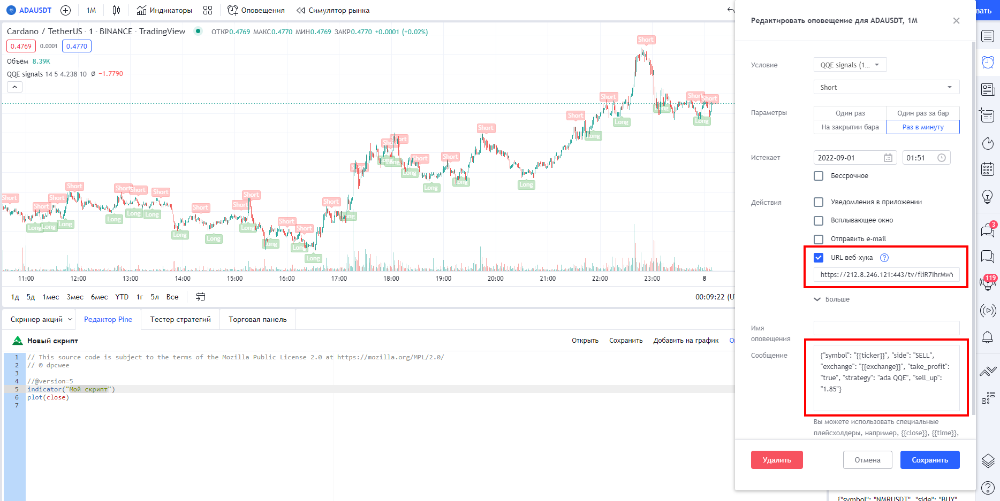

## A-Bot  

Спотовый бот для алгоритмической мультивалютной торговли на бирже Binance, поддерживающий ручную и полностью автоматическую торговлю.    

  
  

**Бот работает бесплатно на аккаунтах Binance, зарегистрированных по реферальной ссылке разработчиков.  
Для остальных пользователей предусмотрена подписка полезного использования, о которой читайте далее.
При первом запуске бота новым пользователям, не являющимся рефералами разработчика, начисляется бонус в размере 10$.  
Binance: [Регистрация по реферальной ссылке](https://accounts.binance.com/ru/register?ref=C2GCPXJA)  
Referal ID: `C2GCPXJA`** 

### Реферальная программа
В боте существует **`многоуровневая реферальная программа`**: человек, которого Вы привели, может указать BEP20-кошелёк от Вашего аккаунта на Binance или Ваш уникальный 6-ти значный реферальный код, который виден в главном меню бота или во вкладке Статистика в личном Telegram-боте. Текущий процент, выплачиваемый пользователям от биржевой комиссии их рефералов первого уровня, полученных разработчиками, составляет `15%`. Также рефовод может получать дополнительно до `7%` за другие уровни в его реферальном дереве. Итого, общий процент реферальных выплат может достигать `22%`. Выплаты производятся каждую субботу, отчёты которых публикуются в [Telegram-канале анонсов](https://t.me/abot_announcements).

### Пополнение баланса:
В связи с обновлением политики торговли по API на Binance от 23.08.2021, торговля по API будет возможна ТОЛЬКО на аккаунтах, прошедших промежуточную верификацию. Для работы бота на аккаунтах, зарегистрированных **НЕ** по реферальной ссылке разработчиков, действует система полезной оплаты за совершённые ботом сделки, которая составляет 0.015% от их размера. При первом запуске бота новым пользователям автоматически начисляется бонус в размере 10$, который виден в личном Telegram-боте. В дальнейшем, в случае отсутствия денежных средств на аккаунте A-Bot, работа бота будет автоматически приостановлена, поэтому не забывайте следить за балансом. Для пополнения баланса A-Bot Вам необходимо будет настроить Telegram-бота по ***[инструкции](https://abot-trade.ru/payment)*** и пополнить баланс на желаемую Вами сумму в любом USD токене, следуя указаниям к переводу. При пополнении баланса начисляется бонус до 50% при пополнении до 400$, свыше этой суммы бонус остаётся фиксированным и составляет 50%.  

**Пользователи, которые зарегистрированы по нашей реферальной ссылке, продолжат пользоваться инструментом бесплатно.**  

### Контакты:  
*[Официальный чат Telegram](https://t.me/abot_chat)* — для обсуждений, связи с разработчиками и развития проекта  

### Полезные ссылки:
*[Мануал по торговым настройкам бота](https://dpcwee.medium.com/%D1%80%D0%B0%D1%81%D1%88%D0%B8%D1%80%D0%B5%D0%BD%D0%BD%D1%8B%D0%B9-%D0%BC%D0%B0%D0%BD%D1%83%D0%B0%D0%BB-%D0%BF%D0%BE-%D0%BD%D0%B0%D1%81%D1%82%D1%80%D0%BE%D0%B9%D0%BA%D0%B0%D0%BC-%D0%B8-%D1%80%D0%B0%D0%B1%D0%BE%D1%82%D0%B5-a-bot-98dcc2dcdc38)* — расширенная инструкция по каждой настройке бота с визуальными примерами  
*[Полное руководство по запуску бота](https://abot-trade.ru/registration)* — подробный гайд по настройке API, Telegram, созданию сервера, а также настройке и запуску бота  
*[Стратегия 92%](https://mega.nz/file/8Y4lmK5B#TAKw4qm_eLcCLEh48zX0HjLATPI0YXEGqaKMNSQQqhc)* — стратегия сохранения депозита вплоть до 70% падения рынка от *[@freebar4ik](@freebar4ik)* & *[@volksacriph](@volksacriph)*  
*[Расчёт усреднений](https://mega.nz/file/wMY0CY4Y#kiz2lgoDIKGae4uxqvuPvWBcolDwKseQhv5qkHmBEaQ)* — таблица расчёта цены и объёма ордеров для усреднений от *[@dpcwee](https://t.me/dpcwee)*  

### Описание стратегии:
Бот работает по стратегии усреднения. Суть стратегии заключается в снижении средней цены входа в актив путём увеличения веса позиции в случае, если рыночная стоимость актива снижается по отношению к текущей стоимости ордера. Иными словами, при входе в сделку бот, исходя из пользовательских торговых настроек, размещает ордер на продажу с заданным процентом профита, но если стоимость актива падает по отношению к первой покупке, не достигнув ордера на продажу, и опускается ниже заданного значения в %, бот отменяет ордер на продажу, докупает определённое количество монет, исходя из торговых настроек, и размещает новую заявку на продажу по цене (`новая средняя цена покупки` + `% желаемой прибыли`). Таким образом, при падении рыночной стоимости актива бот постоянно анализирует текущие ордера и рыночные данные, сопоставляя условия настроек торговой стратегии и биржевую активность, и докупает монеты, увеличивая их общий объём и снижая новую цену продажи.

  

### Обозначения статуса ордеров:
 — Ордер на покупку исполнен  
 — Размещён ордер на продажу  
 — Ордер на продажу исполнен, позиция закрыта  
 — Ордер на продажу отменён для усреднения  
 — Ордер на продажу отменён и активирован трейлинг-стоп  
 — Частичная продажа позиции трейлингом по маркету  
 — Полная продажа позиции по трейлингу, позиция закрыта  

### Ключи запуска:  
* `-s` — Прямой запуск бота в обход главного меню  
* `-pd` — Запуск бота с разблокированным детектором пампов  
* `-ud` — Включить возможность добавления UP/DOWN токенов в список разрешённых монет  
*  `-uo` — Взять в работу ручные ордера, размещённые на продажу (не должно быть открытой ботом позиции по активу). Экспериментальная функция!  
*  `-snl` — Продавать свободные монеты на балансе к приоритетному из quote_asset активу сразу же после листинга этой торговой пары на Binance   
*  `-tld` — Запустить бота на аккаунте Binance US  
*  `-dtl` — Удалить @abot_chat из шапки личного Telegram-канала со статистикой  
*  `-wlinit` — Динамический White List монет. Каждую минуту бот будет обновлять разрешённый список монет из файла wlinit.txt (который необходимо предварительно создать; монеты должны быть перечислены одной строкой через пробел, например BTC ETH BNB). Удобно в том случае, если Вы имеете какие-либо индикаторы и хотите постоянно автоматически фильтровать монеты для торговли  
* `--conf` — Конфигурационный ключ, более подробно о котором можно узнать *[внизу страницы](#%D0%BA%D0%BB%D1%8E%D1%87---conf)*  

### Ключи команд:
* `-s` — Запустить бота  
* `-u` — Обновить бота до актуальной версии при её наличии
* `-m` — Удалить, добавить или сбросить параметры разрешённого для торговли списока монет  
* `-k` — Изменить настройки API ключей от Binance или параметры Telegram  
* `-p` — Изменить параметры торговли и работы бота  
* `-h` — Сбросить всю историю торговли по парам из разрешённого для торговли списка монет. Открытые позиции на бирже не будут отменены, но удалятся из базы данных бота  
* `-i` — Удаление торговой статистики обнулит показатели прибыли и успешных сделок, совершенных ботом  
* `-e` — Безопасный выход из бота (в главном меню) или безопасная остановка торговли и выход в главное меню (при работающем боте)  
* `-dlog` — Удалить все старые логи в папке с ботом  
* `-sat` — Продать все свободные или потерявшиеся монеты (со статусом SELL_ORDER и NO_ORDER) и конвертировать в BNB пыльные остатки  
* `-auto` — Автоматически рассчитать торговые параметры по общему балансу активов, указанных в quote_asset  

### Обозначения информационной консоли:
* `s` — Время исполнения последнего цикла скрипта в секундах  
* `•` — Индикатор скорости обработки торговых скриптов  
  * `Зелёный` — Быстрая обработка  
  * `Жёлтый` — Имеется незначительное отставание  
  * `Красный` — Данный цвет сигнализирует о большом количестве необработанных биржевых операций в стэке данных, что означает недостаточное количество вычислительных ресурсов машины   
* `ПД` — Детектор пампов
  * `Зелёный` — Активирован, мониторит рынок
  * `Жёлтый` — Активирован, но есть незначительное отставание стрима детектора пампов от текущего времени
  * `Красный` — Собирает рыночные данные, ещё не прошёл час с момента запуска бота, либо бот не успевает обрабатывать стрим детектора пампов из-за слабой машины/интернета
* `М` — Максимально допустимое количество одновременно открытых позиций
* `Б` — Свободный баланс
* `Л` — Самый близкий к продаже актив (`название монеты` `разница рыночной цены и цены ордера на продажу в %` (`цена ордера`))
* `Д` — Суточная дельта пар из белого списка в процентах, условно обозначающая тренд рынка
  * `Жёлтый` — Дельта положительная; настройки не блокируют покупки/усреднения
  * `Фиолетовый` — Дельта отрицательная или положительная; если в quote_asset несколько активов для торговли, обозначает блокировку покупок/усреднений по одному/нескольким из них
  * `Красный` — Дельта отрицательная; настройки блокируют покупку/усреднение по всем активам из quote_asset  

  

### Рекомендации:
* Для того, чтобы бот начал работу с ручным ордером, актив должен находится в разрешённом списке монет  
* Не распоряжайтесь активами, которые находятся в работе у бота. Если видите свободный баланс — проверьте монету в терминале, возможно, бот работает по этой монете с активированным трейлингом  
* В случае расставления сеткой ручных ордеров на покупку между ордерами должен быть запас желательно в 1-2% на случай сквизов, в случае которых при резком срабатывании нескольких ордеров одновременно бот не учтёт последний из них  
* Желательный минимальный депозит для комфортной работы бота на любом рынке составляет от 1000-2000$  
* Настоятельно рекомендуем настроить Telegram-бота для управления A-Bot'ом и просмотра необходимой статистики  

### Запуск:
*Windows (>8, >Server 2012)*: Скачайте **[A-Bot.exe](https://github.com/dpcwee/abot/releases/latest)** и запустите программу  
*Linux (Ubuntu >18.04; Debian >9; CentOS >8)*: Скачайте **[A-Bot](https://github.com/dpcwee/abot/releases/latest)** (в терминале на сервере введите  
`wget https://github.com/dpcwee/abot/releases/download/ВЕРСИЯ/A-Bot`, где вместо ***ВЕРСИЯ*** укажите последнюю версию),  
дайте ему права командой `chmod 755 A-Bot`, после чего запустите командой `./A-Bot`  

### Обновление:
При выходе новой версии в течение часа в главном меню A-Bot появится новая ключ-команда `-u` для обновления; также в Вашем Telegram-боте (через который Вы управляете торговым ботом и который отвечает за пуши сообщений в Ваш Telegram-канал) появится новая кнопка `Обновить A-Bot` (при обновлении через Telegram бот перезапустится и начнёт торговлю автоматически)  
**ИЛИ**  
*Windows*: Скачиваете новую версию в директорию со старым файлом (с перезаписью)  
*Linux*: В директории с ботом вводите команду на удаление старой версии `rm A-Bot`, затем вводите команду  
`wget https://github.com/dpcwee/abot/releases/download/ВЕРСИЯ/A-Bot`, где вместо ***ВЕРСИЯ*** указываете последнюю версию, после чего даёте права файлу 
`chmod 755 ./A-Bot` и запускаете его командой `./A-Bot`  

### Работа с screen на Linux:
При самом первом подключении к серверу вводим команды `apt update`, а затем `apt-get install screen` и вводим Enter или Y, если этого требует терминал, чтобы обновить системные пакеты и установить менеджер окон (screen)  
1) Вводим `screen -S <name_screen>` (например `screen -S abot`), попадаем сразу в новый screen и запускаем `./A-Bot` (если файл A-Bot находится в домашней директории, иначе сначала зайдите в папку с ним командой `cd директория_с_ботом`  
2) Запустили бота и можете разрывать соединение с сервером, бот будет работать в фоновом режиме в созданном скрине  
3) При повторном подключении к серверу с существующими скринами вводим `screen -x` (подключение к единственному скрину) или `screen -x <name_screen>`, если их несколько, попадая в нужный скрин. Команда `screen -S` больше не нужна!  
4) В случае перезагрузки сервера (reboot или другой апокалипсис), подключаемся к серверу и повторяем описанный цикл с 1-го пункта  

### Параметры API настройки:
* API ключи — Пара API ключей (`api` и `secret`) для обращения к Binance ([API-Management](https://www.binance.com/ru/usercenter/settings/api-management))  
* `referral` — ID Вашего аккаунта на Binance ([ID Пользователя](https://www.binance.com/ru/my/dashboard) — слева вверху в личном кабинете)  
* BEP20-кошелёк — адрес человека на Binance в сети Binance Smart Chain (BSC BEP20), который рассказал Вам о боте  
* `hash` — Ваш личный хэш для работы бота с сигналами от TradingView или POST запросами
* `abot_stats` — Отправлять торговую статистику разработчикам в целях улучшения бота?
* `tg_notification` — Уведомления в Telegram о закрытых сделках, суточной статистике и текущая сводка в шапке канала  
  * `tg_token` — Токен, выданный [@BotFather](https://t.me/botfather) при создании Telegram-бота  
  * `tg_name` — <@name> или <chat_id> для отправки уведомлений. Бот, созданный на предыдущем шаге, должен состоять в группе/канале и быть её администратором с включенными возможностями публикации сообщений и изменения профиля  
  * `user_id` —  ID Telegram-аккаунта, нужный для управления торговым ботом через Telegram-бота, который можно получить у [@userinfobot](https://t.me/userinfobot), написав ему /start или нажав кнопку "Запустить".

  

### Настройка Telegram:
**[Инструкция настройки Telegram бота и канала](https://abot-trade.ru/connection)**  
Каждый раз, когда бот полностью закрывает позицию на продажу, Вы будете получать уведомление в Ваш канал.  
Если Ваш личный Telegram-бот не отвечает на сообщения, попробуйте: написать Telegram-боту `/start`, проверить работоспособность или перезапустить A-Bot  

  
  

### TradingView или собственные сигналы:
Бот поддерживает работу с сигналами от TradingView, а также принимает сигналы при отправке POST запроса на наш сервер. Вы можете подобрать/создать свой индикатор и посредством вебхуков отправлять команды A-Bot'у для работы с активами, который, в свою очередь, примет этот актив в работу по своим торговым алгоритмам и настройкам пользователя.  
> URL сервера для отправления сигналов, который рассылает сигналы индивидуальным ботам по веб-сокету: *https://212.8.246.121:443/tv/hash*. **hash** Вы найдёте в настроках API и Telegram (-k в главном меню A-Bot).   

> Всё тело сигнала должно быть обёрнуто в фигурные скобки **{}**.  

* Каждый сигнал должен содержать обязательные ключи, без которых бот не сможет среагировать на него:  
  * `'exchange'` ['{{exchange}}'] — Биржа, для которой предназначен сигнал (в случае бота, это единственная площадка 'BINANCE')  
  * `'symbol'` ['{{ticker}}'] — Торговая пара, по которой поступил сигнал  
  * `'side'` ['{{strategy.order.action}}'] — Сигнал на покупку или продажу (направление должно быть обозначено, как 'BUY' или 'SELL'). Если тип сигнал 'BUY' и на этом активе ещё не открыта позиция, то бот откроет ордер, исходя из торговых параметров. Для закрытия позиции по сигналу 'SELL', в сообщении вебхука должен присутствовать ключ 'take_profit' или 'stop_loss' со значениями 'true'  
  * `'strategy'` ['NAME'] — Любое название Вашей стратегии, включая пробелы, цифры и символы  

> *{**"exchange": "{{exchange}}", "symbol": "{{ticker}}", "side": "BUY", "strategy": "my_signal"**}*  

* Необязательные ключи, которые могут быть дополнением к вашей стратегии (в одном сигнале может находиться несколько ключей или все сразу):  
  * `'take_profit'` ['true'] — Продать актив, если по нему уже открыт ордер на продажу и позиция *находится в плюсе* (иначе игнорировать)? *{"exchange": "{{exchange}}", "symbol": "{{ticker}}", **"side": "SELL"**, "strategy": "my_signal", **"take_profit": "true"**}*  
  * `'stop_loss'` ['true'] — Продать актив по стоп-лоссу. Позиция закроется в убыток, если рыночная стоимость актива ниже средней цены входа! {"exchange": "*{{exchange}}", "symbol": "{{ticker}}", **"side": "SELL"**, "strategy": "my_signal", **"stop_loss": "true"**}*  
  * `'averaging'` ['true'] — В случае, если на активе *уже открыта позиция* (иначе игнорировать), после поступления сигнала с этим ключом бот усреднит её, исходя из торговых параметров. *{"exchange": "{{exchange}}", "symbol": "{{ticker}}", **"side": "BUY"**, "strategy": "my_signal", **"averaging": "true"**}*  
  * `'min_order'` ['NUMBER'] — В случае, если на активе ещё *не открыта позиция* (иначе игнорировать), размер min_order берётся из сигнала, а не торговых параметров. *{"exchange": "{{exchange}}", "symbol": "{{ticker}}", **"side": "BUY"**, "strategy": "my_signal", **"min_order": "3.25"**}*  
  * `'sell_up'` ['NUMBER'] — При покупке/усреднении позиции по сигналу, из него также берётся размер sell_up вместо значения из торговых параметров. В случае, если на активе уже открыта позиция, бот просто перевыставит этот ордер с sell_up из сигнала (при этом в сигнале **должны отсутствовать** ключи 'averaging' и 'stop_loss'). *{"exchange": "{{exchange}}", "symbol": "{{ticker}}", **"side": "BUY"**, "strategy": "my_signal", **"sell_up": "2.5"**}*  

  

> Код для отправки сигналов POST запросом на примере Python:  

    import requests, json
    
    url = 'https://212.8.246.121:443/tv/hash'
    data = {"exchange": "BINANCE", "symbol": "BNBBTC", "side": "BUY", "strategy": "my_signal"}
    response = requests.post(url, data=json.dumps(data), headers={'Content-Type': 'application/json'}, verify=False)
    
  

### Торговые параметры:
* `min_bnb` [min >= 0.01] — Минимальный свободный баланс BNB, ниже которого бот будет докупать минимально допустимое количество BNB по рыночной цене для оплаты биржевой комиссии (например 0.03)  
* `min_balance` [100 >= min_balance >= 0] — Не покупать/усреднять позиции, если свободный баланс составляет меньше заданного % от общего баланса (например 15)  
* `position_size` [100>= position_size > 0] — Максимально допустимый размер одной позиции в % от общего депозита. В случае, если после усреднения размер позиции превысит значение position_size от общего депозита, то бот не будет усреднять такую позицию (например 20)
* `min_order` [min >= 1] — Множитель размера первого ордера на покупку. Стоимость первого ордера будет рассчитываться, как **минимальный допустимый размер ордера на бирже** (на USD это 10$, на BTC это 0.0001) * **min_order**. Лимиты можно найти [здесь](https://www.binance.com/ru/trade-rule) (например 1.2)  
* `min_price` [min >= 0.00000001] — Минимальная рыночная стоимость монеты, эквивалент в USD которой равен **рыночному курсу монеты в USD**, ниже которого бот не будет открывать новые сделки по этой паре, лишь усреднять, если стоит ордер на продажу (например 0.05)  
* `min_daily_percent` [-100 < min_daily_percent < daily_percent <= 99999] — Выше какого значения должнен подняться показатель % суточного изменения цены на бирже, чтобы бот осуществил первую покупку по паре (например -20)  
* `daily_percent` [-100 < daily_percent <= 99999] — Ниже какого значения должнен упасть показатель % суточного изменения цены на бирже, чтобы бот осуществил первую покупку по паре (например -3)  
* `auto_daily_percent` [y/n] — Вместо **daily_percent** использовать общую суточную дельту разрешённого списка монет для ограничения максимального процента коридора покупок. Если ***Y***, то бот не будет покупать монеты, выросшие более, чем на `Д` % из информационной строки в консоли  
* `order_timer` [min >= 0] — Интервал паузы между закрытием сделки и новой покупкой по этой же паре в секундах  
* `min_value` [min >= 0] — Эквивалент минимального суточного торгового объёма в USD у торговой пары для открытия позиции по ней  
* `sell_up` [min > 0] — Желаемый % прибыли от продажи без учёта суточной дельты и трейлинг-стопа (например 1.65)  
* `buy_down` [min < 0] — На сколько % должна упасть рыночная цена актива по отношению к цене его последней покупки, чтобы бот усреднил позицию (например -5)  
* `max_trade_pairs` — Допустимое количество позиций на продажу, которое бот может держать одновременно открытыми (например 20). Если количество открытых ботом ордеров станет равно или больше **max_trade_pairs**, бот перестанет совершать новые покупки (кроме усреднений)  
  * `-1` [-1] — Не ограничивать количество одновременно торгуемых ботом пар  
  * `0` [0] — Работать только с уже открытыми ордерами и не совершать новые покупки  
  * `1 и более` [1-999] — Указать максимальное количество позиций вручную  
* `auto_trade_pairs` [y/n] — Разрешить боту автоматически регулировать количество разрешённых пар? Если ***Y***, бот будет автоматически корректировать максимальное количество одновременно торгуемых пар, если предыдущий параметр настроек задан пользователем вручную от 1 до 999  
* `progressive_max_pairs` [y/n] — Использовать прогрессивное уменьшение максимального количества пар. Если ***Y***, то количество пар при включенной настройке **auto_trade_pairs** будет автоматически уменьшаться не только в зависимости от соотношения свободного и общего баланса, но и от количества открытых ордеров и суммарного количества их усреднений  
* `delta_deep` [y/n] — Использовать глубину падения дельты для определения падения рынка и паузы покупок/усреднений? Если ***Y***, то бот будет блокировать новые покупки и усреднения на падающем рынке до тех пор, пока не произойдёт локальный отскок всего рынка. Определение локального отскока зависит от величины падения самой дельты и выражено в пропорции 1 к 10 (при дельте -5 бот начнёт открывать позиции, когда дельта вырастет до -4.5 и выше)  
* `individual_depth` [y/n] — Использовать глубину дельты активов для определения индивидуальных падений и паузы покупок/усреднений по аналогии с delta_deep, только отдельно для каждой торговой пары  
  * `step_aver` [min >= 0] — Шаг увеличения сетки усреднений в %. На сколько процентов увеличивать последующую разницу рыночной цены и цены последней покупки для нового усреднения без учёта buy_down. Сетка усреднений в базе данных при отсутствии усреднений равна 0 и увеличивается каждое усреднение на значение step_aver % (например 1.35)  
* `max_aver` [min >= 0] — Максимальное количество усреднений на одной монете (например 4)  
* `quantity_aver` [min > 0] — Множитель размера усреднения от текущего веса позиции (например 2). Иными словами, при усреднении бот будет покупать **текущее количество монет** * **quantity_aver**, тем самым новая позиция будет равна **текущее количество монет** * **quantity_aver** + **текущее количество монет**  
* `average_percent` [100 > average_percent >= sell_up] — Максимальный желаемый % разницы между рыночной ценой и средней ценой входа в позицию после усреднения (например 7). Бот будет самостоятельно находить объём для усреднения и делать его таким, чтобы после усреднения средняя цена входа в позицию оказалась не выше %-та average_percent от текущей рыночной цены (то есть цены нового усреднения). Иными словами, после усреднения ордер на продажу будет выше от текущей рыночной цены на **average_percent** + **sell_up** % (без учёта остальных динамических настроек, влияющих на sell_up)  
* `trailing_stop` [y/n] — Использовать трейлинг-стоп? Если ***Y***, отодвигать цену продажи в зависимости от движения цены актива. С включенным трейлингом позиция не закрывается сразу, а продаётся частями **trailing_part** на приближенных к максимальным значениям ценам, чтобы увеличить потенциальную прибыль, либо закрывается полностью при падении цены и её приближении к средней цене покупки. Данный параметр сделает стратегию более гибкой, но может уменьшить прибыль 
  * `trailing_percent` [min > 0] — При каком падении от локального хай-уровня цены активировать трейлинг-стоп для частичной/полной продажи (например 0.25)  
  * `trailing_part` [0 < trailing_part <= 100] — Размер частичной продажи по трейлингу в % от общего веса позиции (например 10)  
* `new_listing` [y/n] — Открывать позиции по только что добавленным на биржу активам? Если ***Y***, бот будет покупать монеты сразу после их листинга и игнорировать торговые параметры по типу min_value, min_price, daily_percent и прочих, кроме min_balance и double_asset (по умолчанию статус new_listing присваивается на 3600 секунд и сбрасывается, если за это время не было max_buy_listing продаж)  
  * `trailing_value` [min >= 1] — Минимальная стоимость позиции в эквиваленте к USD, необходимая для активации трейлинг-стопа (например 50)  
  * `listing_order` [min >= 1] — Множитель минимального ордера на паре при листинге (например 3.3)  
  * `max_buy_listing` [0 <= max_buy_listing <= 999] — Сколько раз бот может вновь открывать позиции по только что добавленному на биржу активу, игнорируя торговые параметры? После преодоления этого значения бот не откроет позицию по данному активу, пока условия на торговой паре не будут соответствовать торговым настройкам (например 5)  
* `user_order` [y/n] — Работа с пользовательскими ордерами после ручной покупки. Если ***Y***, то в случае покупки пользователем монеты из разрешённого списка бот автоматически поставит на продажу купленное количество монет и будет работать с этой парой так же, как и в остальных случаях, ориентируясь на торговые настройки. Также уже открытые ордера можно будет усреднять вручную: для этого во время работы бота купить нужное количество монет, после чего бот отменит ордер на продажу, рассчитает новые данные и выставит ордер по новой цене  
* `reinvest_position` [y/n] — Высвобождать частями позиции в инвесте за счёт других прибыльных сделок. Если активно, бот будет направлять часть прибыли от продаж в зависшие убыточные тяжёлые позиции для постепенного высвобождения их объёма  
* `reinvest_percent` [0 < reinvest_percent <= 100] — Какую часть в % от прибыли направлять на реинвестирование в зависшие позиции?  
* `fiat_currencies` [RUB UAH ...] — Если включены уведомления в Telegram, то ежедневная статистика торгов будет рассчитываться в этих валютах вместе с **quote_asset** 
* `quote_asset` [USDT BTC ...] — Котируемые валюты для торговли (то есть те валюты, в паре к КОТОРЫМ торгуются монеты из разрешённого списка (ADA/**USDT**, ADA/**BTC**), а не которые торгуются к ним). Приоритет котируемых активов для первоочередной покупки соответствует их расположению (слева направо)  
* `double_asset` [y/n] — Если ***Y***, бот сможет покупать одну и ту же монету на нескольких котируемых активах одновременно (**ADA**/USDT и **ADA**/BTC)  
* `pump_detector` [y/n] — Использовать детектор пампов для открытия позиций? Если ***Y***, бот будет анализировать все монеты из разрешённого списка монет в реальном времени и, в случае обнаружения всплеска объёмов, доминации покупателей и роста цены актива, незамедлительно покупать монету (работает только на боте, запущенном с `-pd` ключом)  
* `pump_order` [min >= 1] — Множитель размера покупки по сигналу детектора пампов (например 2.5)  
* `pump_up` [min > 0] — Желаемый % прибыли от продажи позиции, открытой или усреднённой по сигналу детектора пампов, без учёта суточной дельты и трейлинг-стопа (например 0.35)  
* `max_pump_pairs` [min >= 0] — Допустимое количество позиций на продажу, открытых по сигналу детектора пампов, которое бот может держать одновременно открытыми (например 10)  
* `trailing_pump` [y/n] — Использовать трейлинг-стоп на ордерах, открытых по сигналу детектора пампов? Если **Y**, то бот будет активировать трейлинг на таких ордерах по параметрам `trailing_stop`'a  
* `signals` [y/n] — Принимать торговые сигналы от TradingView или POST запросов посредством вебхуков  
* `max_signals` [0 < signals <= 999] — Максимальное количество позиций, открытых по сигналам  

  

### Ключ --conf:
Все они активируются через общий ключ --conf либо при вводе ключей при запуске бота (например, ./A-Bot --conf sell_up 1-2 --conf mpp 5), либо через личного Telegram-бота в Торговых параметрах (введя --conf sell_up 1-2, затем с новой строки --conf mpp 5). Активные ключи также видны в Telegram-боте в Торговых настройках. Для удаления ключа(-ей) без перезапуска бота введите --conf НАЗВАНИЕ_КЛЮЧА(-ЕЙ) в Торговых настройках Telegram-бота.

* Ключ `mop` (активируется командой ***--conf mop ЧИСЛО***) — Автоматически рассчитывать min_order на основании свободного баланса, если включена progressive_max_pairs, в противном случае на основании общего баланса. Бот будет делать минимальный ордер таким, чтобы работать только с указанным ЧИСЛОМ % от свободного/общего баланса

* Ключ `mlp` (активируется командой ***--conf mlp ЧИСЛО***) — Автоматически рассчитывать listing_order на основании свободного баланса, если включена progressive_max_pairs, в противном случае на основании общего баланса. Бот будет делать минимальный ордер при листинге таким, чтобы работать только с указанным ЧИСЛОМ % от свободного/общего баланса

* Ключ `mpp` (активируется командой ***--conf mpp ЧИСЛО***) — Автоматически рассчитывать pump_order на основании свободного баланса, если включена progressive_max_pairs, в противном случае на основании общего баланса. Бот будет делать минимальный ордер Детектора пампов таким, чтобы работать только с указанным ЧИСЛОМ % от свободного/общего баланса

* Ключ `step_aver` (активируется командой ***--conf step_aver 2.25-5-3-...-n***, числа разделяются дефисом и могут быть с остатком, количество чисел неограниченно. Если номер усреднения превышает количество индексов в ключе, то сетка отмеряется по стандартному значению step_aver из настроек) — Ручная сетка процентов усреднений (вместо одного значения step_aver, которое добавляется к общей сетке при каждом усреднении, вы можете задать свои значения). Дефисы служат для разделения чисел, обозначающих их индекс при усредненях (после покупки монете нужно упасть на buy_down% + 0% (сетка усреднений пока равна нулю, т.к. не было усреднений) для первого усреднения, для второго усреднения на buy_down + 0 + ЧИСЛО[2.25], для третьего на buy_down + 2.25 + ЧИСЛО[5], для четвёртого на buy_down + 7.25 + ЧИСЛО[3] и т.д.)

* Ключ `average_percent` (активируется командой ***--conf average_percent 5-7-9.5-...-n***, числа разделяются дефисом и могут быть с остатком, количество чисел неограниченно. Если номер усреднения превышает количество индексов в ключе, то параметр average_percent берётся из настроек) — Аналог параметра average_percent, только индивидуальный для каждого индекса усреднений

* Ключ `quantity_aver` (активируется командой ***--conf quantity_aver 1-1.5-2-...-n***, числа разделяются дефисом и могут быть с остатком, количество чисел неограничено. Если номер усреднения превышает количество индексов в ключе, то объём усреднения берётся в качестве quantity_aver из настроек) — Ручная сетка объёма усреднений quantity_aver

* Ключ `sell_up` (активируется командой ***--conf sell_up 1.15-0.95-0.77-...-n***, числа разделяются дефисом и могут быть с остатком, количество чисел неограниченно. Если номер усреднения превышает количество индексов в ключе, то объём усреднения берётся в качестве sell_up из настроек) — Ручная сетка для желаемой прибыли от продажи актива

* Ключ `pump_up` (активируется командой ***--conf pump_up 0.35-0.55-0.4-...-n***, числа разделяются дефисом и могут быть с остатком, количество чисел неограниченно. Если номер усреднения превышает количество индексов в ключе, то объём усреднения берётся в качестве pump_up из настроек) — Ручная сетка для желаемой прибыли от продажи активов, открытых Детектором пампов

* Ключ `super_list` (активируется командой ***--conf super_list ADA-XRP-BNB-...-n***, монеты разделяются дефисом, их количество неограниченно) — Суперлист пользователя, монеты из которого не будут подпадать под торговые настройки для покупки (кроме double_asset и min_balance). Иными словами, при продаже монеты из суперлиста бот не будет анализировать торговые параметры и ограничения, которые бы не дали боту снова открыть позицию по этой монете, а купит её сразу же после продажи (некая бесконечная торговля)

* Ключ `buy_down` (активируется командой ***--conf buy_down 2.15-3.55-4.8-...-n***, числа разделяются дефисом и могут быть с остатком, количество чисел неограниченно. Если номер усреднения превышает количество индексов в ключе, то объём усреднения берётся в качестве buy_down из настроек) — Ручная сетка для процентов падения для нового усреднения

* Ключ `pump_value` (активируется командой ***--conf pump_value ЧИСЛО***) — Минимальный объём суточных торгов в эквиваленте к USD для открытия позиции по сигналу детектора пампов

* Ключ `pump_signal` (активируется командой ***--conf pump_signal qm1-q2-q1...***, то есть типы сигналов детектора пампов) — Детектор пампов будет работать только по тем типам сигналов, которые указаны в ключе. Всего 6 типов сигналов: q1, q2, q3, qm1, qm2, qm3

* Ключ `reverse_sort` (активируется командой ***--conf reverse_sort high***) — Режим обратной сортировки по приоритету открываемых позиций (не с самых просевших, а самых выросших за сутки)

* Ключ `reverse_average` (активируется командой ***--conf reverse_average high***) — Режим обратной сортировки по приоритету усреднений (усреднение от наименее просевших позиций к самым далёким)

* Ключ `trailing_stop` (активируется командой ***--conf trailing_stop long***) — Длинный трейлинг позиций (без триггера стоп-лосса, продажа позиции будет происходить частями trailing_part до тех пор, пока не кончатся монеты в позиции)

* Ключ `stop_loss` (активируется командой ***--conf stop_loss ЧИСЛО***) — Включить стоп-лосс для выхода из позиций, если рыночная цена таких активов упала на ЧИСЛО% по отношению к средней цене входа

* Ключ `listing_timer` (активируется командой ***--conf listing_timer ЧИСЛО***) — Через какое время в секундах (по умолчанию 3600) снимать с монеты после листинга статус new_listing, если счётчик продаж не достиг max_buy_listing с момента листинга пары

  
